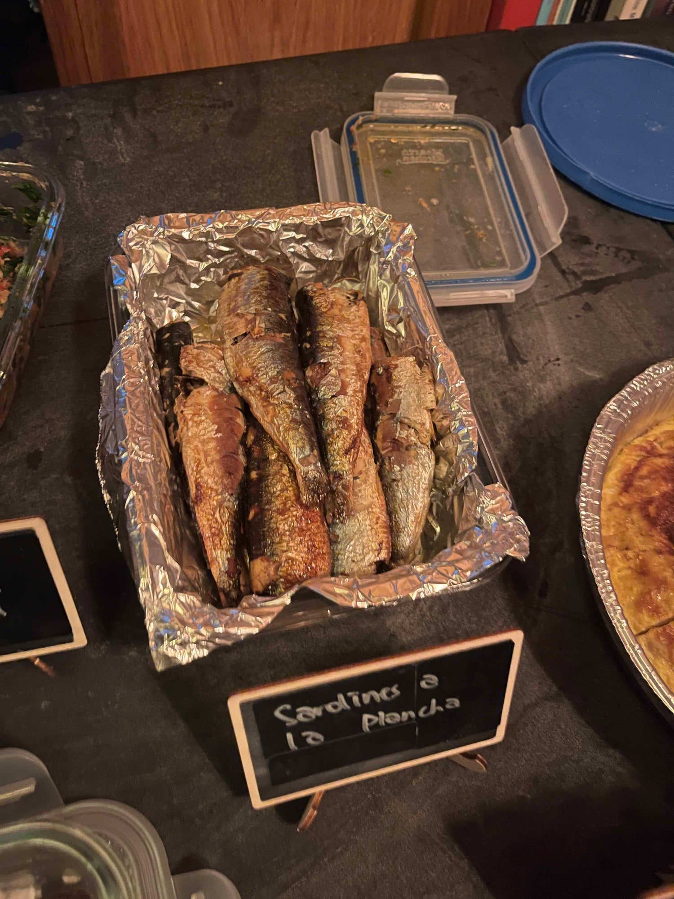
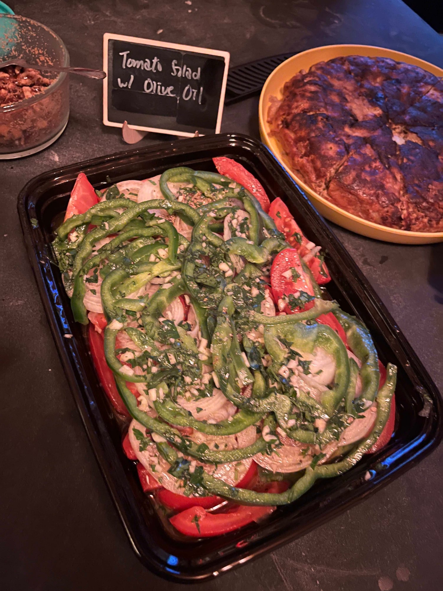
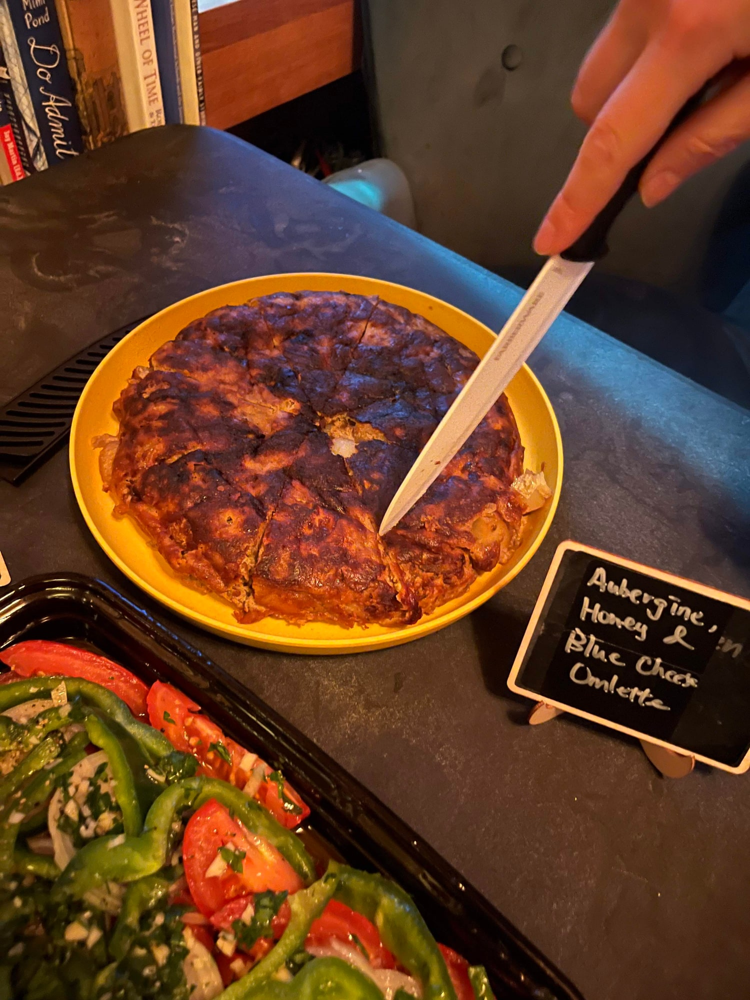
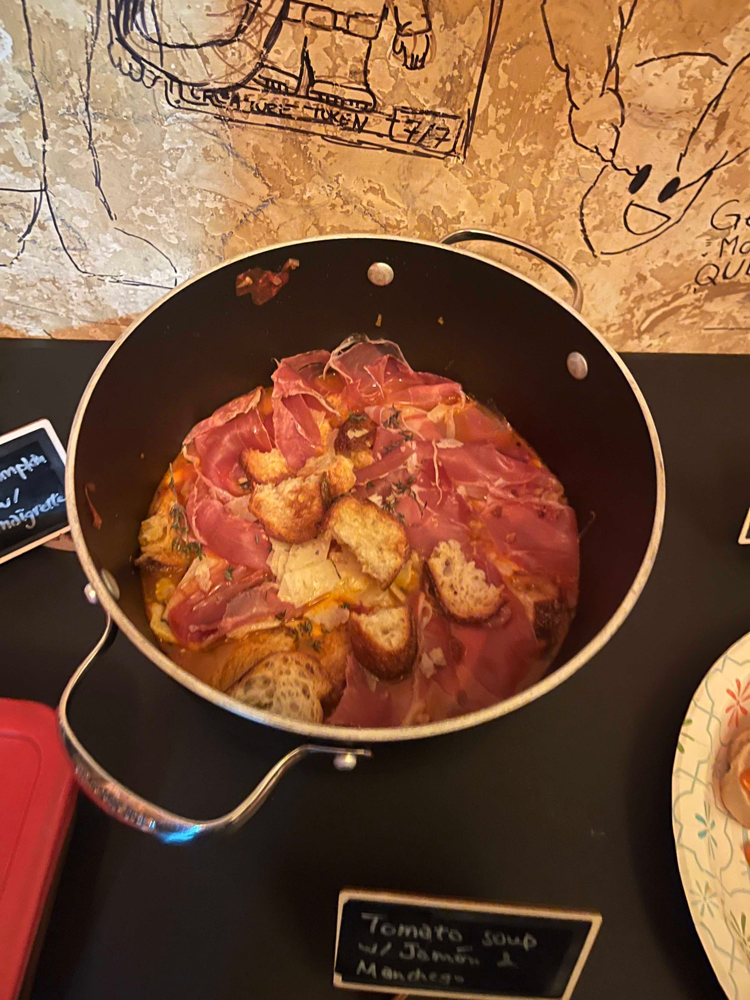
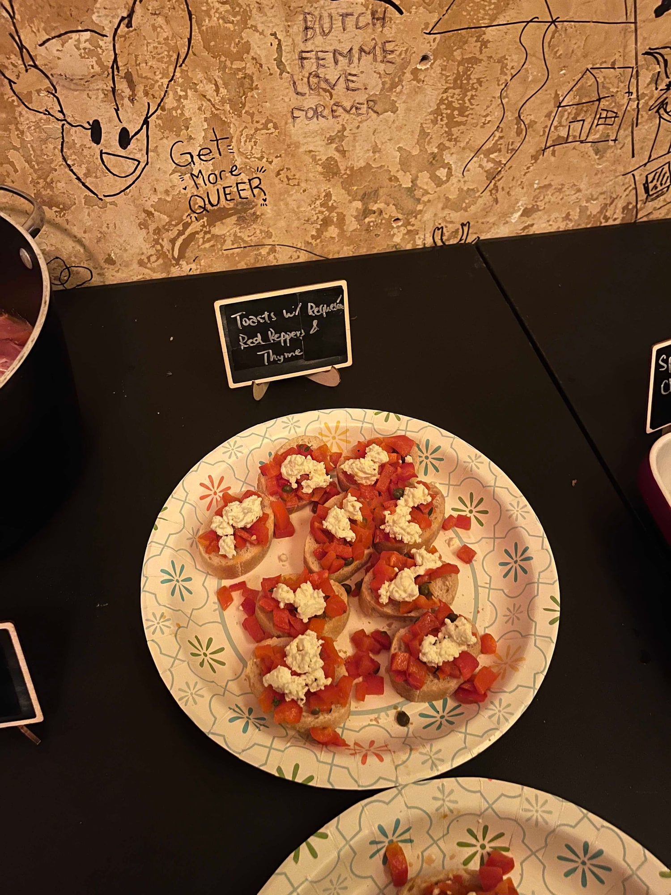
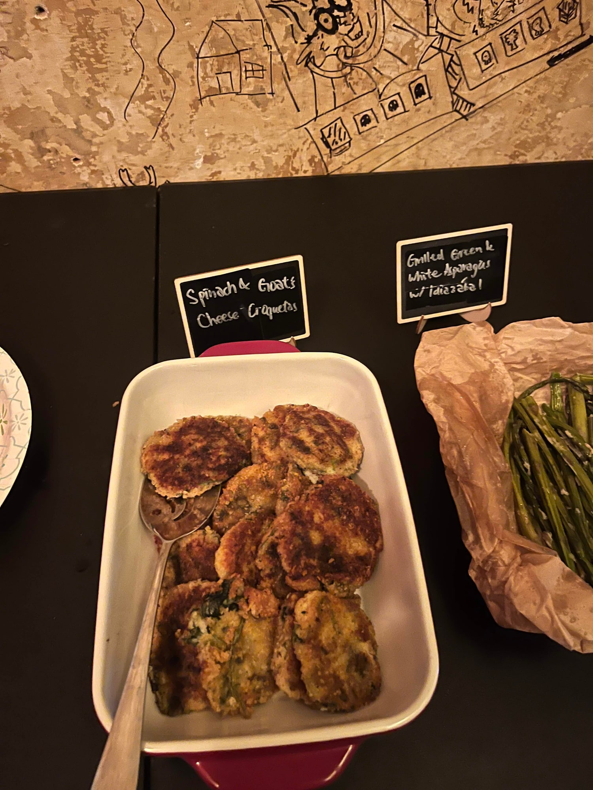

*Basque* by José Pizarro stays tightly focused on a specific corner of northern Spain: peppers, tinned fish, cider and plenty of things served on bread. Most of the room was cooking something genuinely unfamiliar, which is usually when these nights are at their best.

Small things led the way, as they always do. Toasts with requesón, red peppers and thyme went before some people had taken their coats off. Sardines and a tomato salad with good olive oil, both exactly as simple as they sound and entirely dependent on being done properly. Spinach and goat's cheese croquetas. An aubergine, honey and blue cheese omelette that I would never have put together myself and immediately wanted the recipe for.

Silkan's cream cheese ice cream with blackcurrant and camomile syrup was the flavour of the night, and I can only report on it secondhand. By the time I reached it there was nothing left but what had melted at the bottom, so I drank that. Worth it.

It was also our first collab with Danu Social House. Huge thanks for letting us run the event there for free. Being in Danu's graffitied room changed the feel of the night in a way we did not expect.

A lot of people said afterwards that they would never have cooked any of it on their own. That is more or less the entire point of the club.

We run one of these every month. [Subscribers get the link](/contact) before spots open to everyone.

