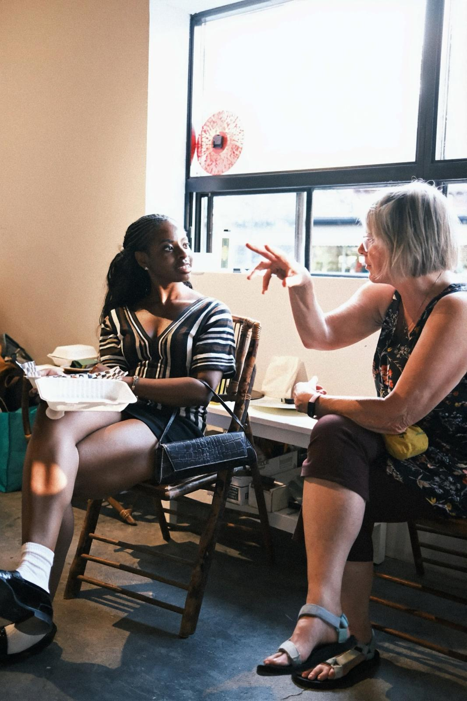
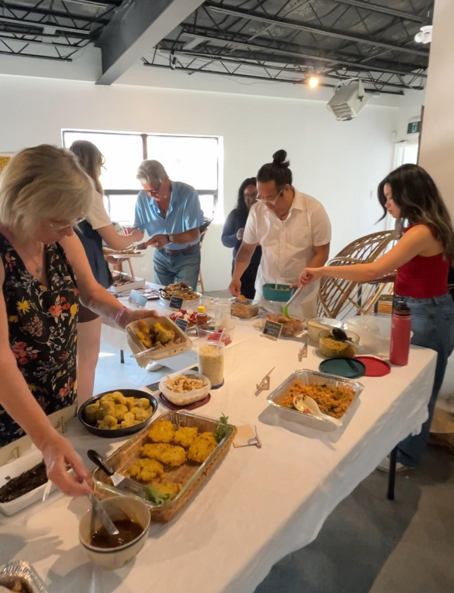
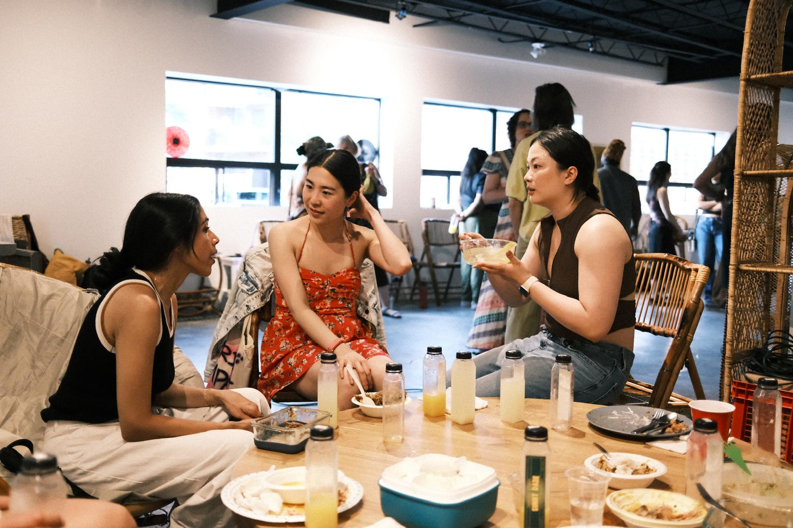

Caribbean night might have been our favourite yet. People were asking for it before we announced the book, and the sign ups showed it.

It was our biggest group at the table so far, and somehow every single dish landed. Jerk chicken, pepper shrimp, a tray of arroz con pollo that kept getting topped up. We lost count of how many times someone went back for seconds.

Then there was the plantain. Four people signed up for plantain and went in four completely different directions: Greg made piñon, the plantain casserole, Vee did fried sweet, Teresa fried green, and Marie made a plantain tarte tatin. That last one was my favourite thing all night. I did not know you could put plantain in a tart, and it came out sweet without being too sweet by Asian standards, which is a bar most desserts here do not clear.

The room was loud in the best way. A lot of people arrived already knowing the cuisine, and you could feel that confidence in the room.

A big thank you to **Sunny Daze** for keeping us all cool with their lemonade all night. It disappeared fast.

We run one of these every month. [Subscribers get the link](/contact) before spots open to everyone.

