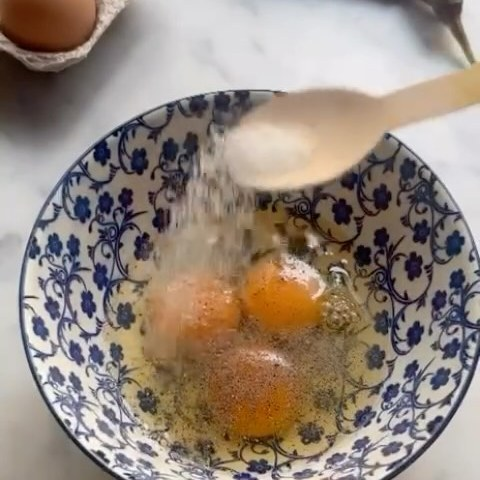

import InstagramEmbed from "../../../components/InstagramEmbed.astro";

April took us to northern Spain with **Basque: Spanish Recipes from San Sebastián & Beyond** by José Pizarro. Two firsts in one night: our first Basque menu, and our first meetup at Danu Social House.

## Aubergine, Honey & Blue Cheese Omelette

Honey and blue cheese in an omelette sounds wrong on paper. It is the recipe test that had us counting down the days.

- 500 ml olive oil
- 300 g aubergines (eggplant), sliced
- 200 g waxy potatoes, sliced
- 8 free-range eggs
- 75 g blue cheese
- 2 to 4 tablespoons honey
- Sea salt and freshly ground black pepper

<InstagramEmbed url="https://www.instagram.com/p/DWoczmNRDvV/" />

## Classic Tortilla

Two of them turned up, and neither survived the evening.

- 3 medium potatoes (about 375 g), finely sliced
- 1 small onion, finely sliced
- 4 large free-range eggs
- 200 ml olive oil for the potato, plus 3 tablespoons for the tortilla
- Sea salt and freshly ground black pepper

The flip is the scary part. The book talks you through it.

## Spinach & Goat's Cheese Croquetas

The recipe makes 32 to 34, which turned out to be exactly the right number for a room this size.

- 500 g baby leaf spinach
- 400 ml full-fat milk
- 100 ml strong vegetable stock
- 80 g butter
- 125 g plain flour
- 80 g goat's cheese, crumbled
- Freshly grated nutmeg, sea salt, black pepper
- 2 eggs, beaten + 125 g dry breadcrumbs, for coating
- Olive oil, for deep-frying

## Beef Cheeks in Red Wine Sauce

Somebody braised beef cheeks in a full bottle of Rioja and carried the pot to a potluck.

- 1 kg beef cheeks, cut into large chunks
- 1 bottle of Rioja
- 2 carrots, 1 onion, 1 celery stalk, chopped
- 1 bay leaf, a few sprigs of thyme
- 3 garlic cloves, 10 black peppercorns
- 200 ml fresh beef stock, olive oil, salt and pepper
- For the book's cauliflower purée: 1 cauliflower, 500 ml whole milk, 50 g butter

## From the night

Reading off the name cards: toasts with piquillo peppers and thyme, tomato soup with jamón and Manchego, grilled green and white asparagus, and a T-bone with anchovy. Our recipe test reels also covered porrusalda, the Basque leek and potato soup, and cuajada with honey and walnuts for dessert.

<InstagramEmbed url="https://www.instagram.com/p/DXZT2W3xfxm/" />

Thank you to Danu Social House for lending us the room.
