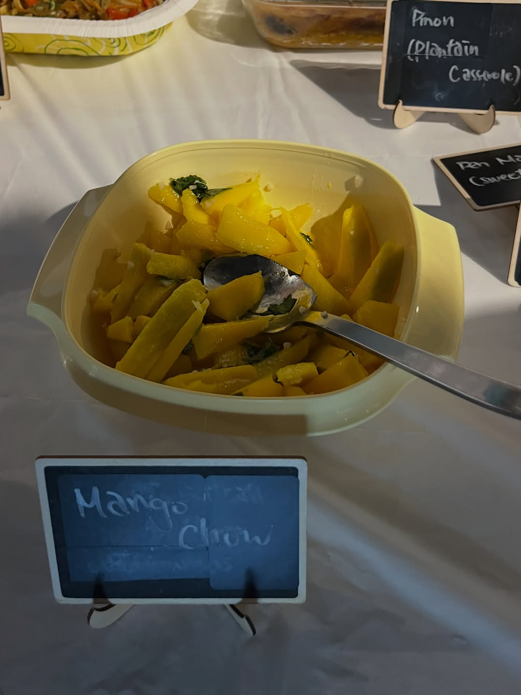
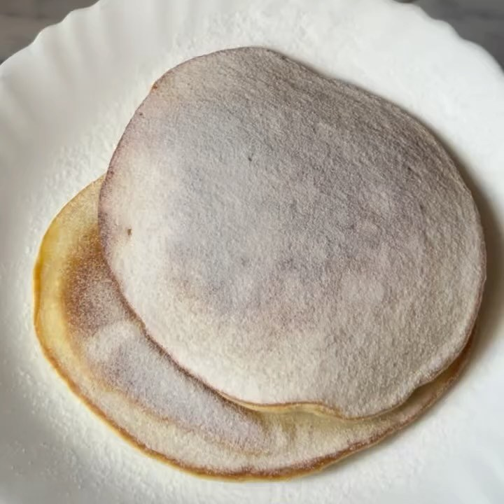
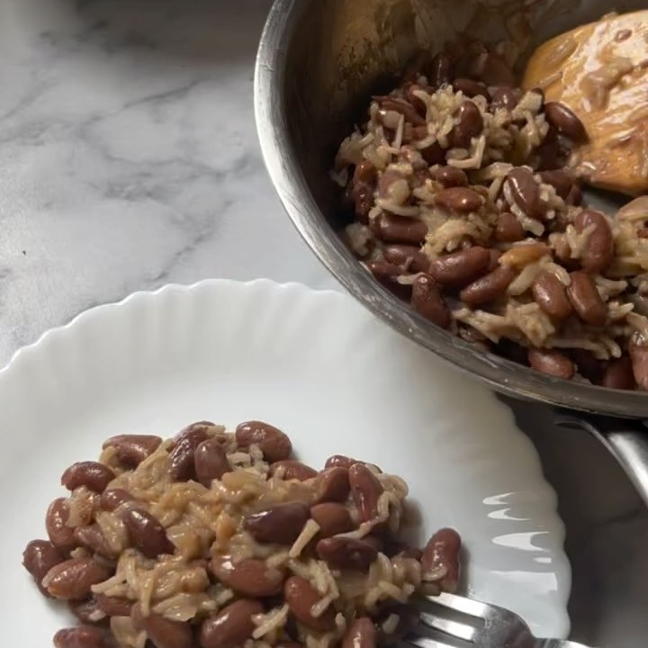
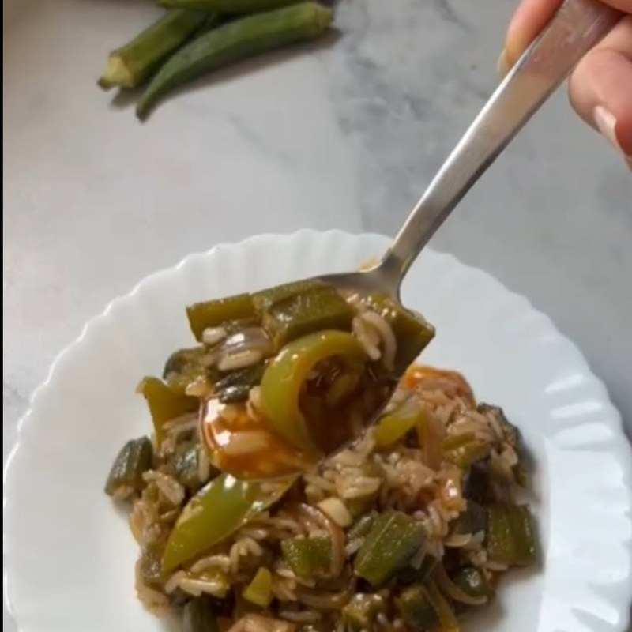
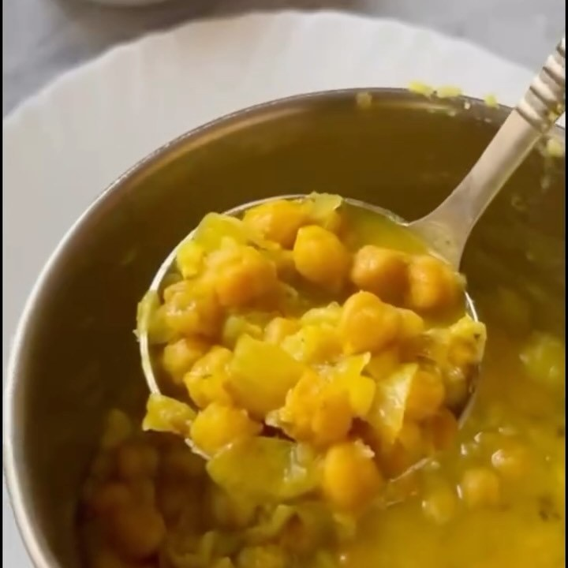

import InstagramEmbed from "../../../components/InstagramEmbed.astro";

**Belly Full: Exploring Caribbean Cuisine Through 11 Fundamental Ingredients and Over 100 Recipes** by Lesley Enston is organized around eleven core ingredients rather than by course, so the chapters are things like Beans, Okra, and Calabaza. Every recipe carries the island it comes from. Thirty-odd RSVPs made June our biggest table yet, hosted at Jrew's on Niagara Street.

The evening itself has its own write-up in the [Caribbean Night recap](/blog/caribbean-june-2026). This post is about the book.

## Cala (Black-Eyed Pea Fritters, Aruba)

Six ingredients, one of which is oil.

- 1 cup dried black-eyed peas
- ¼ cup water
- 2 garlic cloves, chopped
- ½ Scotch bonnet pepper
- 1 teaspoon kosher salt
- Neutral oil, for frying

## Arepa di Pampuna (Calabaza Pancakes, Curaçao)

Squash pancakes with cinnamon and nutmeg, somewhere between breakfast and dessert. We recommend testing these at home before you commit to bringing them.

- 1 cup all-purpose flour
- 3 tablespoons granulated sugar
- 2 teaspoons baking soda
- 1 teaspoon ground cinnamon
- ½ teaspoon freshly grated nutmeg
- ¼ teaspoon kosher salt
- 2 eggs
- 1 cup calabaza purée (recipe in the book)
- ½ cup whole milk
- 1 teaspoon vanilla extract
- ¼ cup raisins (optional)
- Coconut oil for the pan, powdered sugar for dusting

## Diri ak Pwa (Rice and Beans, Haiti)

Kidney beans and coconut milk, with the Scotch bonnet left whole rather than chopped.

- 1 cup dried kidney beans
- 3 tablespoons extra-virgin olive oil
- 1 yellow onion, chopped
- 4 garlic cloves, minced
- 1 cup coconut milk
- 1 Scotch bonnet pepper
- 5 whole cloves
- 1 teaspoon fresh thyme leaves
- 2 cups long-grain rice
- 1½ teaspoons kosher salt

## Arroz con Quimbombó (Rice and Okra, Cuba)

A strong argument for anyone still skeptical about okra.

- 1 tablespoon extra-virgin olive oil
- ½ pound okra, cut into ¼-inch pieces
- 1 small yellow onion, diced
- ½ green bell pepper, diced
- 3 garlic cloves, minced
- 2 oz salted ham or chorizo, cubed (optional)
- ½ cup tomato sauce
- 1 teaspoon kosher salt
- 1 cup medium-grain rice

## Curried Chana and Aloo (Trinidad and Tobago)

Chickpeas and potato. Note that it calls for culantro, which is a different herb from cilantro and worth tracking down.

- 3 tablespoons coconut oil
- 1 small yellow onion, diced
- 5 garlic cloves, minced
- 1 Scotch bonnet pepper, minced
- 2 tablespoons Trinidad curry powder
- ¼ teaspoon turmeric, ½ teaspoon ground cumin
- 6 culantro leaves, minced
- 2 teaspoons fresh thyme leaves
- 1 large potato, cubed
- 2 cans (15.5 oz) chickpeas, drained
- 3 scallions, thinly sliced
- 2 teaspoons kosher salt

## Mango Chow (Spicy Mango Salad, Trinidad and Tobago)

That is the one in the photo above. Half-ripe mango, lime, garlic, and Scotch bonnet. About five minutes of work.

- 2 half-ripe large mangoes, sliced into thick strips
- Juice of 2 limes
- 1 teaspoon kosher salt
- 5 garlic cloves, minced
- ½ Scotch bonnet pepper, seeded and minced
- ¼ cup fresh cilantro, roughly chopped

## From the night

<InstagramEmbed url="https://www.instagram.com/p/DZVYNTxRi51/" />

<InstagramEmbed url="https://www.instagram.com/p/DaQDjZ1RREw/" />
