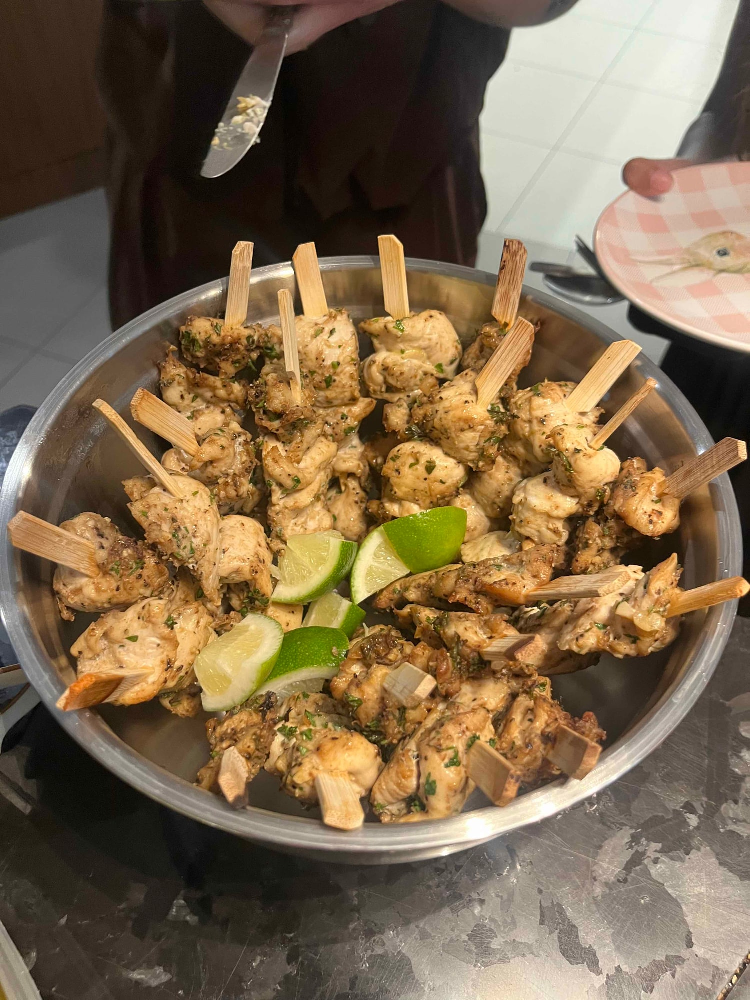

import { REACH } from "../../../config/theme.config.ts";

A cookbook club is a group that picks one cookbook, has each person make a different recipe from it, and then gets together to share all the dishes. That's how Sauté Sundays works. Mady and I started our cookbook club with nine people in 2025, and it's grown into a community of {REACH.community} people in Toronto, with {REACH.seats} seats every month and usually a waitlist on top of that.

You don't need a group of foodie friends to join one, and you don't need to be a great cook either. Here's how cookbook clubs work, how to find one, and what your first night is actually like.

## What is a cookbook club?

It's basically a book club where the homework is cooking, and clubs run it in a few different ways. Some meet in one kitchen and cook together, some rotate between members' homes, and some follow a cuisine or theme instead of a single book. Some are a handful of friends, and some, like ours, are public and open to anyone. At Sauté Sundays, everyone cooks at home beforehand and brings their dish to a monthly potluck at a venue in downtown Toronto.

## How does a cookbook club work?

A common cookbook club format looks like this:

1. You RSVP for an event.
2. You find out which cookbook is featured that month.
3. You claim a recipe so nobody else makes the same one.
4. You cook it at home before the event.
5. You bring it, everything gets laid out, and everyone eats.
6. You spend the night talking about what everyone made.

At Sauté Sundays, you get a link to our recipe index in your confirmation email, put your name next to the dish you want, and bring 6 to 8 portions to share.

## Why join a cookbook club?

The best part is getting to taste so much of one cookbook at once. Buy a cookbook on your own and you might make two recipes from it before it goes back on the shelf. At Sauté Sundays, one night puts around 30 recipes from the same book in front of you, and you find out pretty quickly which ones are worth making at home.

You also end up eating things you'd never have picked for yourself, because someone else chose them. It's an easy way to meet people, since everyone already has something to talk about, and having a dish due every month is a good push to actually cook from the books you own. About {REACH.attendees} people have come to Sauté Sundays since 2025 and nearly half have come back, so for a lot of them it's turned into a regular night out.

## How do you find a cookbook club?

Search "cookbook club" plus your city, or "cookbook club near me", and check event platforms like Luma and Eventbrite, Instagram, and local bookstores and libraries. Before you sign up, it's worth looking at:

- whether there's an upcoming event, or the last post was eight months ago
- recent photos, so you can see what the nights actually look like
- a clear explanation of the format and what you need to bring
- group size, since 8 people at someone's house and 35 at a venue feel very different
- whether beginners are welcome, and if there are easier months
- how they handle allergies
- cost, and whether you're expected to buy the book

There isn't one right kind of club. Some people want a small group of regulars at someone's home, and others like a bigger room where there's always someone new to meet.

## Can you go to a cookbook club alone?

Yes. At Sauté Sundays, most people come alone the first time. The food makes it a lot easier than walking into a party where you don't know anyone, because every dish arrives with a conversation already attached to it: who made it, what's in it and whether it was a pain to cook. Nobody has to come up with small talk.

## Do you have to be a good cook?

No. The question we hear most before someone's first night is some version of "what if my dish isn't good enough?" and our answer is always the same: it's not a competition and nobody's grading it. Some dishes come out perfect and some don't, and the ones that went a little wrong usually get the best conversations going.

If you're nervous, look for a night aimed at beginners. We run a [Stress Free edition](/blog/cookbook-vietnamese-july-2026) every few months with a cookbook picked for simple techniques and ingredients you can find at a regular grocery store.

## Do you need to buy the cookbook?

It depends on the club. At Sauté Sundays you don't have to, and most people don't. You can borrow it on Libby or from a friend, or look up the recipe you claimed in a copy at the bookstore.

If you can buy it, it's a nice way to support the author, and it happens more often after a good night than you'd expect. After our Greek month, people went out and bought [My Big Fat Greek Cookbook](/blog/cookbook-greek-mar-2026) because the recipes were so easy for how good everything turned out.

## What should you bring to a cookbook club?

Your dish, enough to share, and whatever you need to serve it. Every club handles portions, warming, plates and leftovers a little differently, so check with the organizer before you go. At ours, that also means your own plate and cutlery and a container for leftovers, and [our FAQ](/faq) has the rest of the details for Sauté Sundays nights.

## How do cookbook clubs handle allergies?

It varies a lot, so look for a club that's clear about ingredients and ask the organizer how they handle allergies before you sign up. At Sauté Sundays, you tell us about allergies when you RSVP, our recipe index flags allergens and vegan or vegetarian dishes, and dishes are labelled with common allergens on the night.

It's still a potluck with food from lots of different kitchens, so message the organizer about anything serious and take your own precautions. At least the dish you bring is one you know you can eat.

## What's your first cookbook club night actually like?

Expect a lot of food and a lot of people asking what you made. At Sauté Sundays, everyone arrives with their dish, it all goes out together, and people just keep reaching. You'll meet regulars who've been to almost every night and people who are there for the first time, with every level of cooking in between, and you'll probably leave with a couple of recipes you want to try at home. Nobody's going to ask for your LinkedIn, either. We keep career chat out of the room, so the night stays about the food.

One of our members, Andrea, summed it up after our August night: "So fun!! You learn so many new dishes & you meet people who love food!"

## Looking for a cookbook club in Toronto?

If you're in Toronto, Sauté Sundays meets every month downtown. We pick a cookbook, everyone cooks a different recipe at home, and {REACH.seats} of us get together to share it potluck style. It's free, [newsletter subscribers](/contact) get early access before spots go public, and they usually go fast.

[See what's coming up next](https://lu.ma/sautesundaysto)

## Want to start your own cookbook club?

We started with nine people and a spreadsheet, and we wrote down everything we've learned since in [How to Start a Cookbook Club: What 14 Events Taught Us](/blog/how-to-start-a-cookbook-club).
