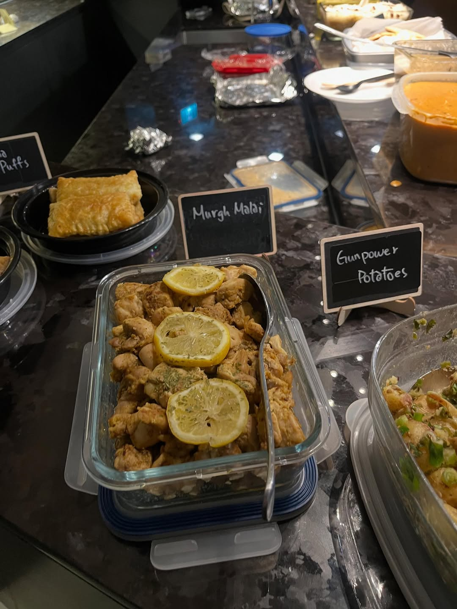
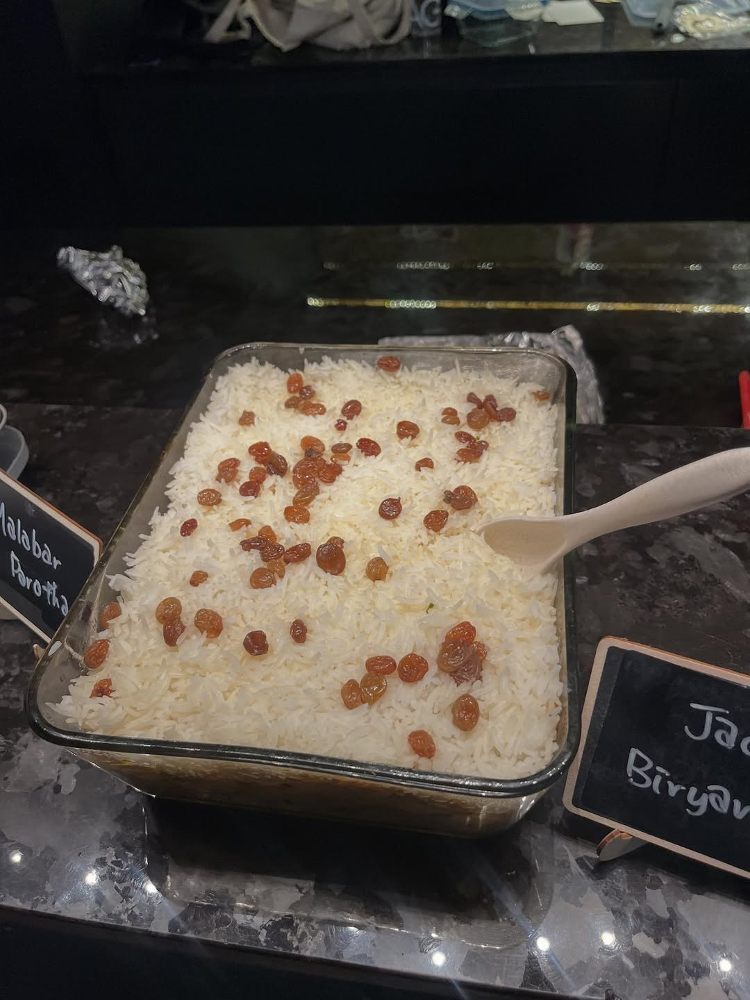
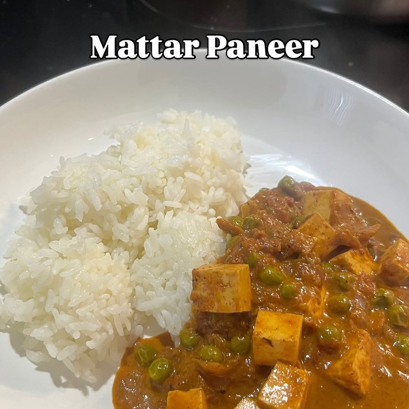
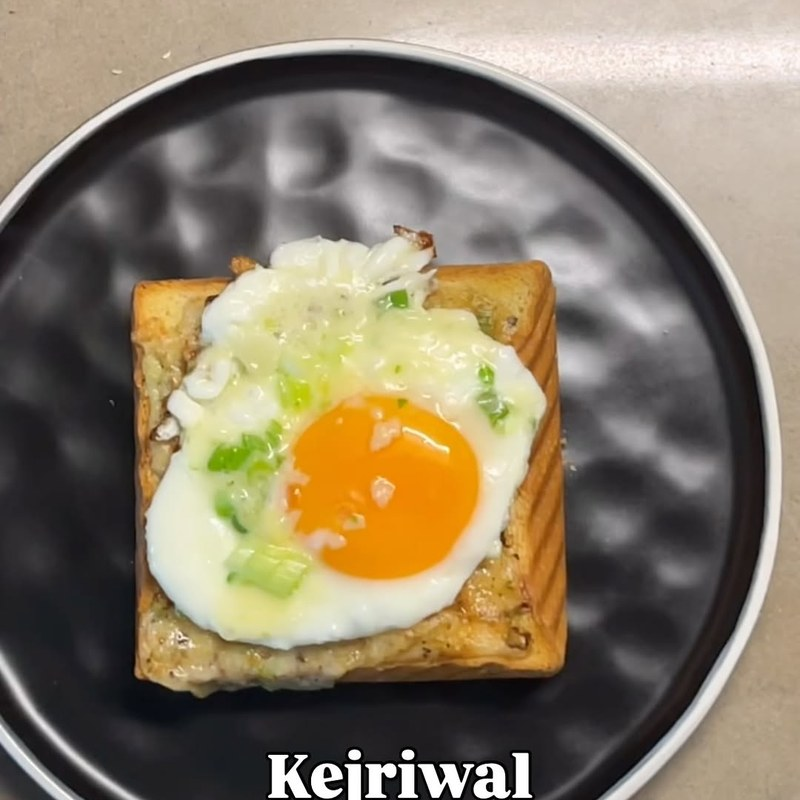
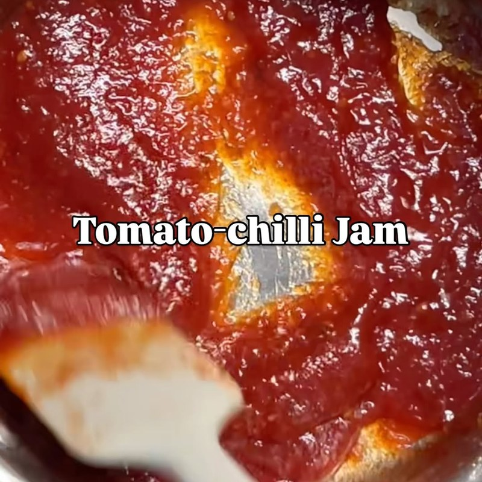

import InstagramEmbed from "../../../components/InstagramEmbed.astro";

**Dishoom: From Bombay with Love** is the cookbook from the London restaurants of the same name, built as a tribute to the old Irani cafés of Bombay. It reads as much like a travel diary as a cookbook, and it set off more recipe testing in the weeks beforehand than any other month we have done. We used it to close out 2025, and the cold did not thin the crowd at all.

## Jackfruit Biryani

Our recipe-testing obsession for the two weeks before the event. Layered rice over spiced fried jackfruit, sealed under a lid you are not allowed to lift.

**Rice:** 300g basmati rice · 2 tsp fine sea salt · juice of ½ lime

**Jackfruit:** 2 × 400g tins jackfruit · garlic and ginger pastes (recipes in the book) · ½ tsp fine sea salt · ¼ tsp ground turmeric · ½ tsp deggi mirch chilli powder · vegetable oil for deep-frying

**Biryani base:** 150g baby new potatoes · crispy fried onions (in the book) · garlic and ginger pastes · 1 tsp fine sea salt · 1 tsp deggi mirch · 1½ tsp ground cumin · ¼ tsp garam masala · 20ml lime juice · 150g full-fat Greek yoghurt · 2 green chillies · fresh ginger matchsticks · mint and coriander leaves

**Topping:** 30g sultanas · 30g butter · 3 tbsp double cream · saffron water (in the book)

## Mattar Paneer

Comfort food, and the dish that had us counting down the days to the event.

- 300g onion-tomato masala (the book's base recipe)
- ¼ tsp fine sea salt
- 30g tomato purée
- ⅓ tsp granulated sugar
- ⅓ tsp garam masala
- ¼ tsp ground cumin
- 100g frozen peas
- 200g paneer, cut into 2cm cubes
- 75ml double cream
- Coriander leaves and kachumber, to serve

## Kejriwal

A fried egg on chilli cheese toast. Easily the simplest thing we cooked all month. We ended up posting about it twice.

- 80g mature Cheddar, grated
- 1 or 2 thick slices of white bloomer, sourdough, or brioche
- 2 spring onions, chopped
- 1 green chilli, very finely chopped
- 1 tsp vegetable oil (optional)
- 1 or 2 large eggs (one per slice)
- Coarsely ground black pepper, ketchup to serve

Here's how it comes together:

<InstagramEmbed url="https://www.instagram.com/p/DQ4OOOrEeu-/" />

## Tomato-Chilli Jam

One of us was already on batch two before the event had even happened.

- 800g tomatoes, roughly chopped (with juice if tinned)
- 60g fresh root ginger, finely chopped
- 15g garlic (3 to 4 cloves), finely chopped
- 8g green chillies (2 to 3), finely chopped
- 300g granulated sugar
- 125ml rice vinegar

## House Black Daal

A short ingredient list and a very long cook. It is also cheap to make.

- 300g whole black urad daal
- Garlic and ginger pastes (in the book)
- 70g tomato purée
- 8g fine sea salt
- ⅔ tsp deggi mirch chilli powder
- ⅓ tsp garam masala
- 90g unsalted butter
- 90ml double cream
- Chapatis to serve (also in the book)

## And everything else

Two that deserve a mention: the butter garlic crab, which somebody was brave enough to attempt, and the keema puffs on the cover of this post, which lasted minutes.

<InstagramEmbed url="https://www.instagram.com/p/DR40oyaEdAr/" />

That was the last event of 2025. We took December off.
