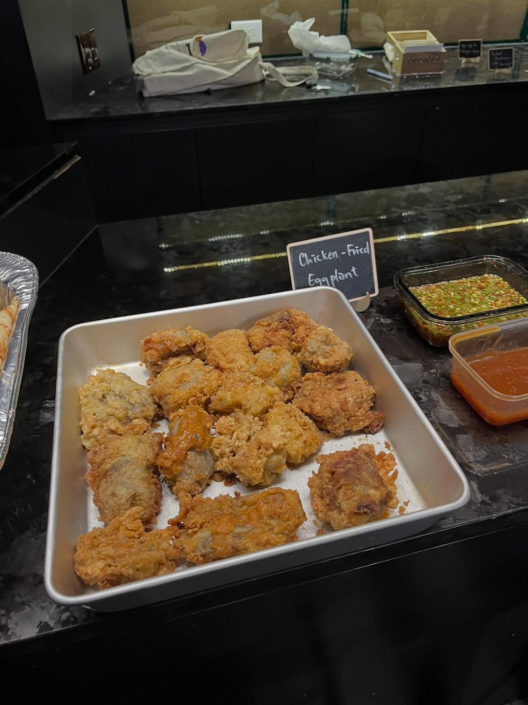
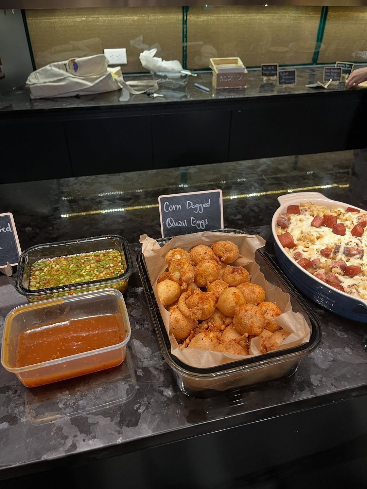
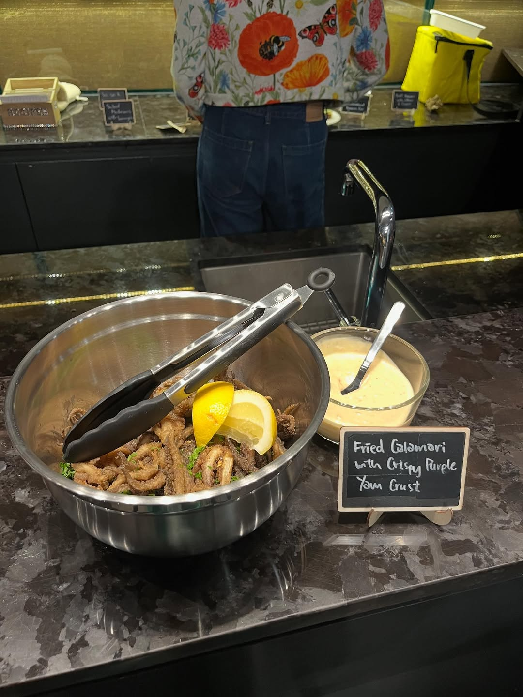
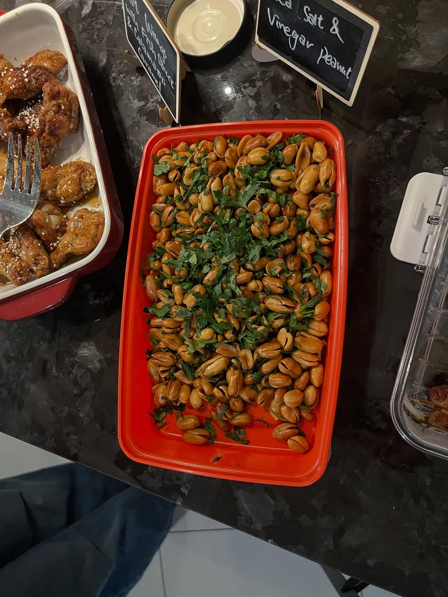
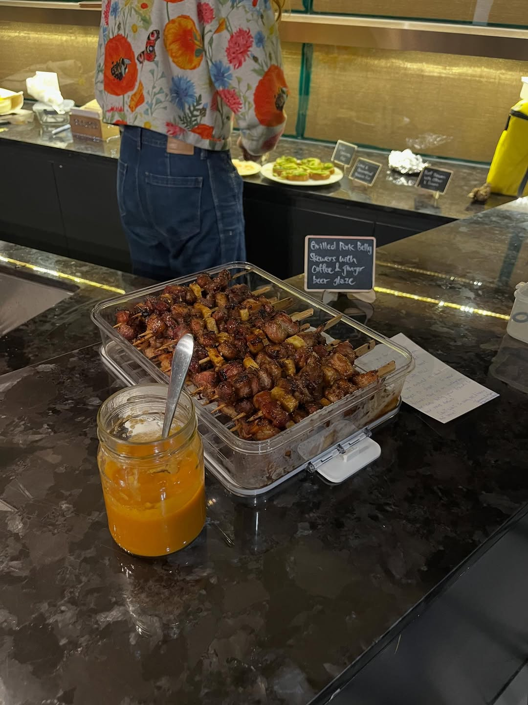

import InstagramEmbed from "../../../components/InstagramEmbed.astro";

**Pulutan! Filipino Bar Bites, Appetizers and Street Eats** by Marvin Gapultos collects the food Filipinos eat while drinking, which is close enough to our whole philosophy that the pick made itself. Almost every chalkboard at the event matched a recipe title word for word.

## Corn-Dogged Quail Eggs (Kwek-Kwek)

Quail eggs in corn dog batter. A Filipino street food staple, and the first thing to disappear that night.

- 2 dozen quail eggs
- ½ cup all-purpose flour
- ⅓ cup cornmeal
- 2 teaspoons sugar
- ½ teaspoon salt, plus more to taste
- ½ teaspoon baking soda
- 1 large chicken egg, beaten
- ¼ to ½ cup beer, preferably a pale lager
- Canola oil, for frying

## Fried Calamari with Crispy Purple Yam Crust

The ube flour turns the crust a colour that had the whole table taking photos before anyone touched it.

- 1 lb cleaned fresh squid, tubes and tentacles
- ½ cup all-purpose flour
- ½ cup purple yam (ube) flour
- ½ teaspoon cayenne pepper
- ½ teaspoon freshly ground black pepper
- Coarse sea salt
- Chopped parsley and calamansi (or lemon) wedges, to serve
- Canola oil, for frying

## Hot Wings with Fish Sauce and Calamansi Caramel

The glaze here is the book's Patis-Mansi Arnibal, a fish sauce and calamansi caramel that is worth making on its own.

**Wings:**
- 2½ lbs chicken wings
- ¼ cup Fish Sauce and Calamansi Caramel (below)
- 1 to 2 teaspoons Green Mango Hot Sauce (also in the book) or sambal oelek
- 1 tablespoon each chopped chives and sesame seeds
- Canola oil, for frying

**Fish Sauce and Calamansi Caramel:**
- ½ cup brown sugar
- 1 tablespoon water
- 4 tablespoons fish sauce
- 4 tablespoons fresh calamansi or lime juice

## Grilled Pork Belly Skewers with Coffee and Ginger Beer Glaze

Coffee and ginger beer in a marinade sounds like a stunt until you taste it.

- 2 lbs fresh skinless pork belly
- 12 oz ginger beer or ginger ale
- 1 cup strong brewed coffee
- 4 tablespoons soy sauce
- 2 tablespoons molasses
- ¼ teaspoon freshly ground black pepper
- 2-inch piece fresh ginger, cut into matchsticks
- 1 tablespoon brown sugar

## From the night

<InstagramEmbed url="https://www.instagram.com/p/DVUdCY3EfJN/" />

Everything else on the table came out of the same book: chicken-fried eggplant, beer and Spam mac and cheese, pineapple pigs in a blanket, sea salt and vinegar peanuts, sautéed mushrooms with lemongrass, grilled tomato and green onion skewers on toast, beer-marinated chicken skewers with a shrimp paste rub, and beer and peanut brittle for dessert.
