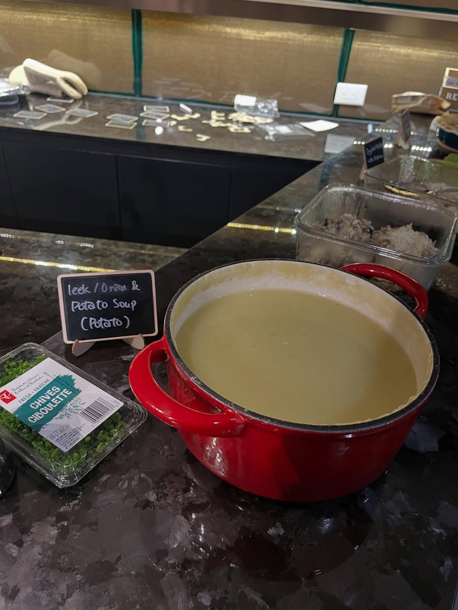
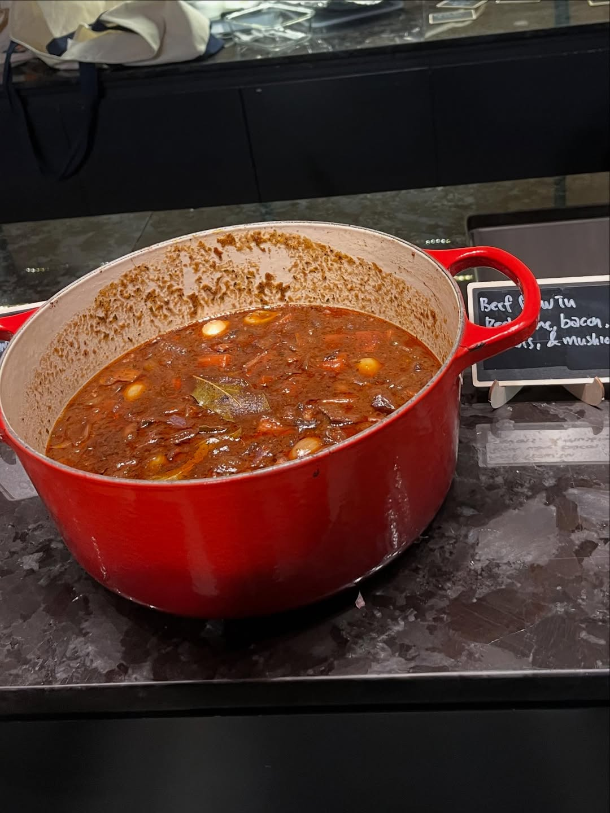
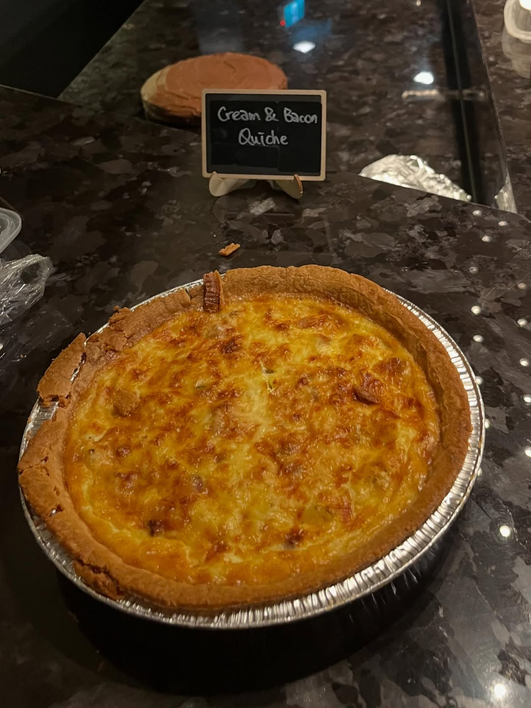
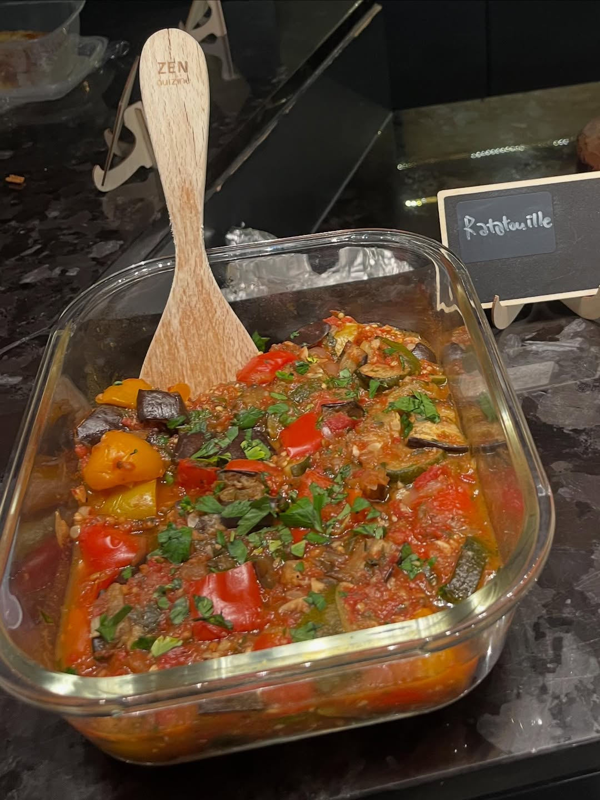

import InstagramEmbed from "../../../components/InstagramEmbed.astro";

To start the year we went with **Mastering the Art of French Cooking** by Julia Child, Simone Beck, and Louisette Bertholle. Nobody held back. The table in January read like a list of the book's greatest hits, name cards and all.

## Boeuf Bourguignon

Beef stew in red wine with bacon, onions, and mushrooms. Julia's most famous recipe, and the centre of our table.

- A 6-ounce chunk of bacon
- 1 Tb olive oil
- 3 lbs lean stewing beef, cut into 2-inch cubes
- 1 sliced carrot, 1 sliced onion
- 1 tsp salt, ¼ tsp pepper
- 2 Tb flour
- 3 cups full-bodied young red wine
- 2 to 3 cups brown beef stock
- 1 Tb tomato paste
- 2 cloves mashed garlic
- ½ tsp thyme, a crumbled bay leaf
- 18 to 24 small white onions, brown-braised
- 1 lb quartered fresh mushrooms, sautéed in butter

The onions and mushrooms are cooked separately and added at the end, which is the step people skip and shouldn't.

## Quiche Lorraine

Cream and bacon, in Julia's pâte brisée shell.

- 3 to 4 oz lean bacon
- An 8-inch partially cooked pastry shell (the book's Pâte Brisée)
- 3 eggs (or 2 eggs and 2 yolks)
- 1½ to 2 cups whipping cream, or half cream and half milk
- ½ tsp salt, a pinch each of pepper and nutmeg
- 1 to 2 Tb butter, cut into pea-sized dots

## Potage Parmentier

Leek and potato soup. It is the first recipe in the book and still one of the best things in it.

- 1 lb peeled potatoes, sliced or diced
- 1 lb thinly sliced leeks, including the tender green
- 2 quarts water
- 1 Tb salt
- 4 to 6 Tb whipping cream, or 2 to 3 Tb softened butter
- 2 to 3 Tb minced parsley or chives

## Ratatouille

Eggplant, zucchini, peppers, onions, and tomatoes, each cooked on its own before anything gets layered together. Julia is firm about this.

- 1 lb eggplant
- 1 lb zucchini
- 1 tsp salt
- 4 to 6 Tb olive oil
- 1½ cups thinly sliced yellow onions
- 2 sliced green bell peppers
- 2 cloves mashed garlic
- 1 lb firm ripe tomatoes, peeled, seeded, and juiced
- 3 Tb minced parsley
- Salt and pepper

## From the night

<InstagramEmbed url="https://www.instagram.com/p/DTyf0hlka-B/" />

Reading the rest of the name cards: an onion tart with anchovies and black olives (Pissaladière Niçoise, the one on the cover of this post), moules marinière, tomatoes Provençale, roast chicken with port and cream, creamed Brussels sprouts, mushroom-stuffed eggplant, and a gratin of shredded potatoes with ham and eggs. All of it out of the same book.
