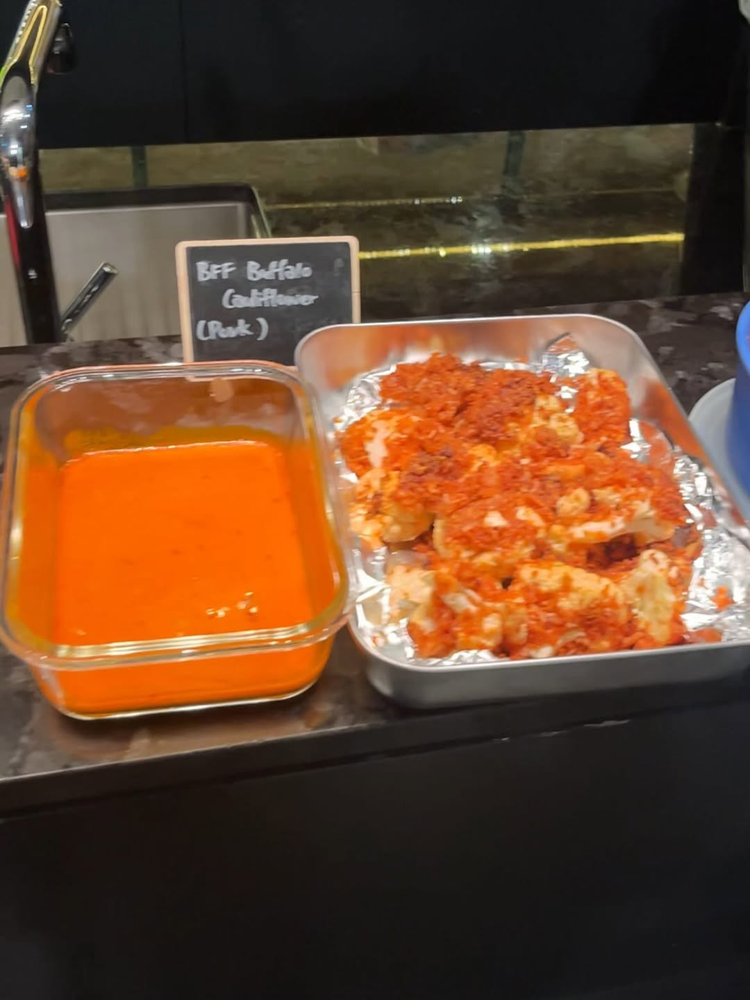
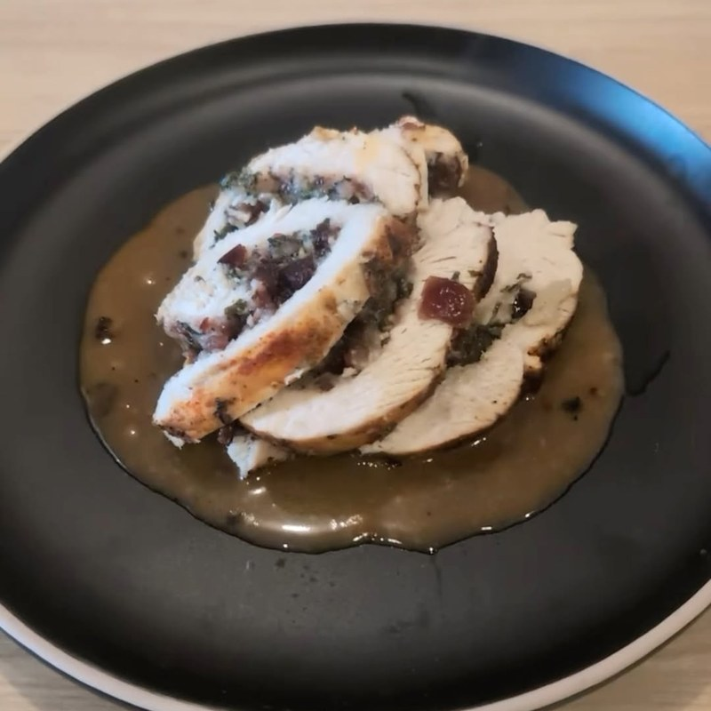
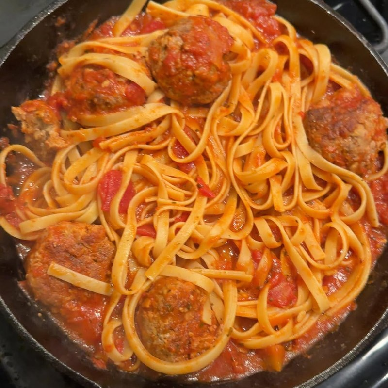
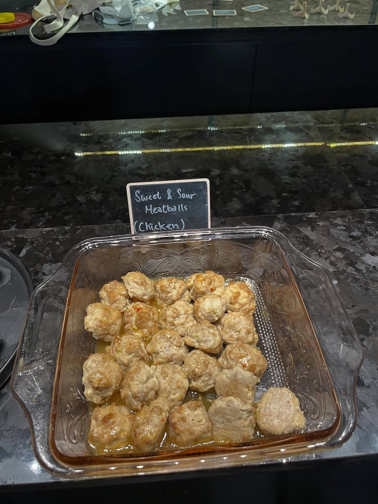
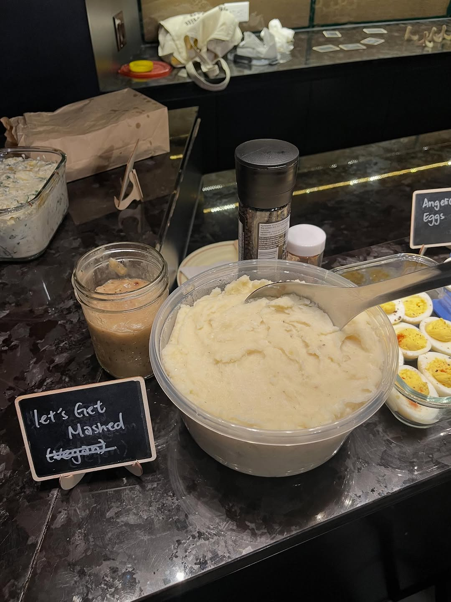

import InstagramEmbed from "../../../components/InstagramEmbed.astro";

**The Friendsgiving Cookbook: 50 Recipes for Hosting, Roasting, and Celebrating with Friends** by Taylor Vance is built for the exact thing we used it for: Thanksgiving with your chosen family and none of the family politics. Most of the recipe names are puns and all of them are genuinely easy, which made it our most beginner-friendly pick so far.

## The Best Stuffed Turkey Breast

Rolled around a cranberry and herb stuffing, then sliced. The kind of thing that makes you want to host dinner just for the smell.

- ¼ cup dried bread crumbs
- ¼ cup chopped fresh flat-leaf parsley
- 2 tablespoons chopped fresh sage
- 2 teaspoons chopped fresh rosemary
- 2 cloves garlic, finely chopped
- ½ cup dried cranberries, finely chopped
- 1½ teaspoons kosher salt + ¾ teaspoon black pepper, divided
- ¼ cup extra-virgin olive oil, divided
- 1 boneless turkey breast (3 lb)
- 1 teaspoon paprika
- ¼ cup dry white wine

It is a pressure-cooker recipe, which surprised us. The butterflying and rolling are in the book.

## La Mia Famiglia Meatballs

The book tells you to claim this one as a family heirloom. After the recipe test we more or less did.

- 1 lb ground beef
- 1 lb ground pork
- 2 large eggs
- 1 cup shredded mozzarella
- 1½ oz ground pork rinds
- 1 tablespoon dried Italian seasoning
- 1 teaspoon garlic powder
- 2 teaspoons salt
- ½ cup marinara sauce (such as Rao's), for serving

<InstagramEmbed url="https://www.instagram.com/p/DPzlf7ikVwA/" />

## Scrumptious Sweet-and-Sour Meatballs

October somehow produced two separate meatball recipes. Nobody objected.

**Meatballs:**
- 1 lb ground pork or chicken
- 4 scallions, finely chopped, plus more for serving
- 2 tablespoons finely grated fresh ginger
- 1 tablespoon less-sodium soy sauce
- 1 large egg white
- ½ teaspoon kosher salt

**Sauce:**
- ½ cup fresh orange juice
- ½ cup rice vinegar
- ¼ cup sugar
- 5 to 6 teaspoons chili-garlic sauce
- 2 tablespoons cornstarch + 2 tablespoons water

## Let's Get Mashed

That is the recipe's actual name, and the chalkboard at the event quoted it word for word. Vegan mash with parsnips, plus a gravy that skips the mushrooms.

**Potatoes:**
- 4 medium russet potatoes, peeled and chopped
- 3 parsnips, peeled and chopped
- 4 cloves garlic, peeled
- ¼ cup unsweetened almond or cashew milk
- 2 tablespoons olive oil
- 1 teaspoon sea salt, ½ teaspoon black pepper
- ¼ cup chopped fresh parsley (optional)

**Gravy:**
- 3 tablespoons olive or avocado oil
- 3 tablespoons brown rice flour
- 1 teaspoon black pepper
- 1 cup good-quality vegetable stock
- ¼ teaspoon sea salt

## From the night

<InstagramEmbed url="https://www.instagram.com/p/DQFM_6ukYGx/" />

The rest of the table ran to Hot Girl Shrimp, deviled eggs, stuffed mushrooms, a pumpkin spice and oat cake, and a vegan mac and cheese. Most of it came out of the same book. Happy Friendsgiving to everyone who came.
