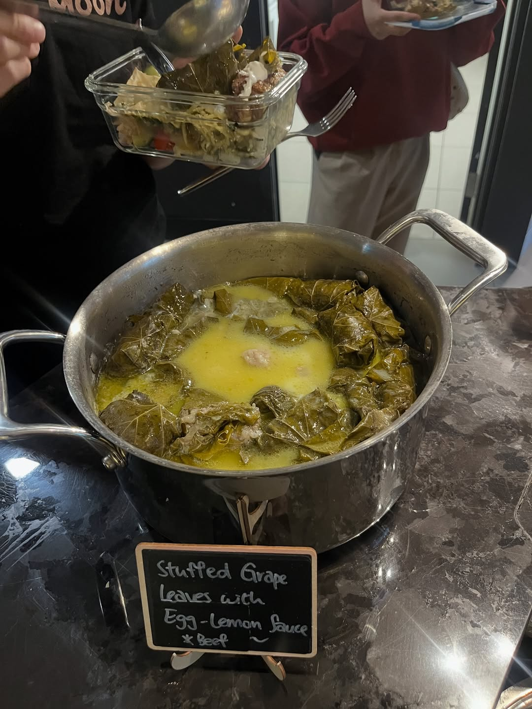
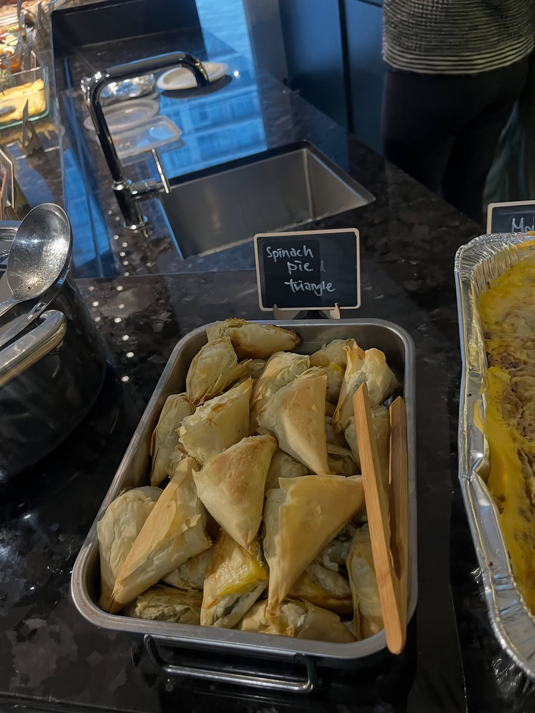
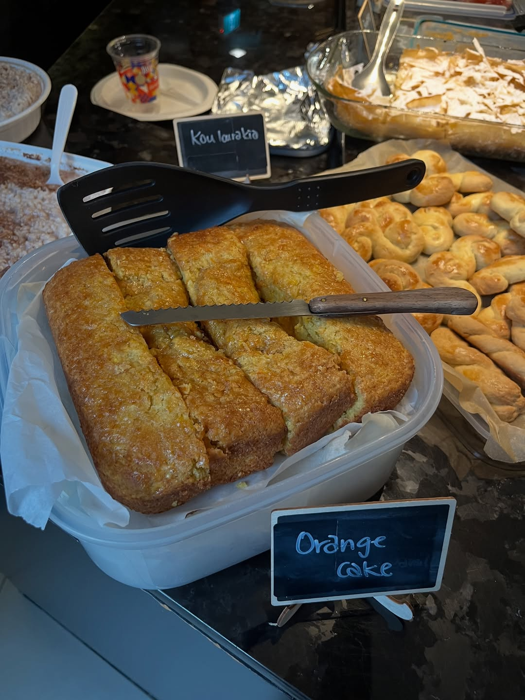

import InstagramEmbed from "../../../components/InstagramEmbed.astro";

**My Big Fat Greek Cookbook: Classic Mediterranean Soul Food** by Christos Sourligas and Evdokia Antzinas is a family recipe collection, the sort of thing a yiayia would actually cook from. March went fully Greek, and the next morning we were eating leftover orange cake and apple cake for breakfast.

## Spinach Pie (Spanakopita)

We loved this so much during recipe testing that it got its own countdown post.

**Filling:**
- 10 oz spinach
- 6 scallion shoots
- 2 cups freshly chopped dill
- 3 eggs
- ½ cup uncooked Italian-style rice
- 5.3 oz feta cheese
- 3 tablespoons olive oil + 2 tablespoons vegetable oil
- ½ tablespoon salt, ½ teaspoon pepper

**Crust:**
- 10 phyllo dough sheets
- Olive and vegetable oil for brushing

Two cups of dill is not a typo, and the phyllo layering is the whole game.

<InstagramEmbed url="https://www.instagram.com/p/DWJ9BokRImM/" />

## Apple Cake (Milopita)

Dusted with icing sugar and gone by the end of the night, minus what we hid for the next morning.

- 6 apples, plus sugar and cinnamon for sprinkling
- 4 eggs
- 1 cup milk
- 1 cup olive oil (or vegetable oil, or a combo)
- 1½ cups sugar
- 4 cups all-purpose flour
- 4 teaspoons baking powder
- 2 teaspoons vanilla powder
- 1 teaspoon cinnamon
- Greek honey and powdered sugar, for the glaze

## Orange Cake (Keik Portokali)

The apple cake's rival. The table never settled the argument, so make both.

- 1 large orange
- 2½ cups all-purpose flour
- 1 cup sugar
- 2½ teaspoons baking powder
- ½ teaspoon baking soda
- ½ teaspoon vanilla powder
- 2 eggs
- ½ cup olive oil
- ½ cup milk
- ¼ teaspoon cinnamon
- Greek honey and sugar, for the glaze

## From the night

<InstagramEmbed url="https://www.instagram.com/p/DWUninxvTui/" />

Also from the book: koulourakia, the butter cookies sitting next to the orange cake in that photo, plus bougatsa and keftedes.
