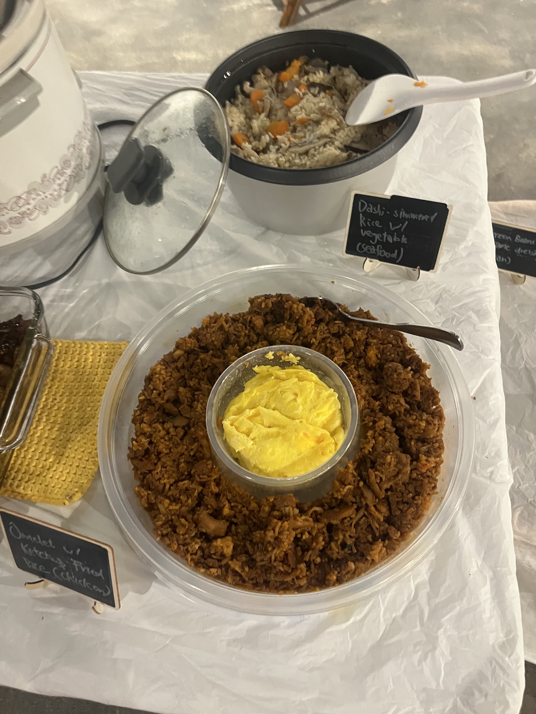
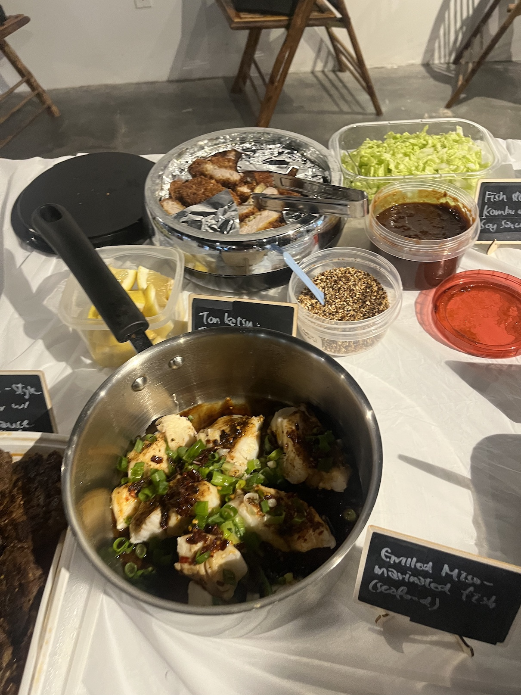
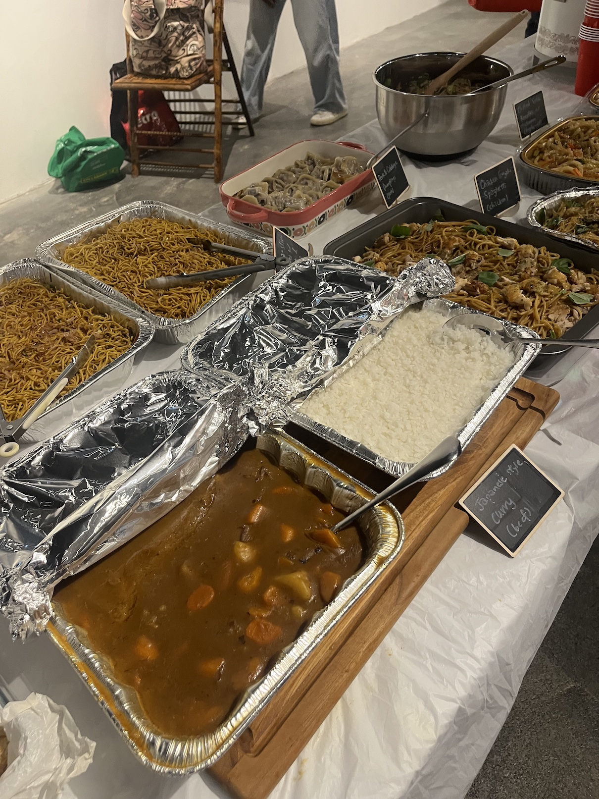
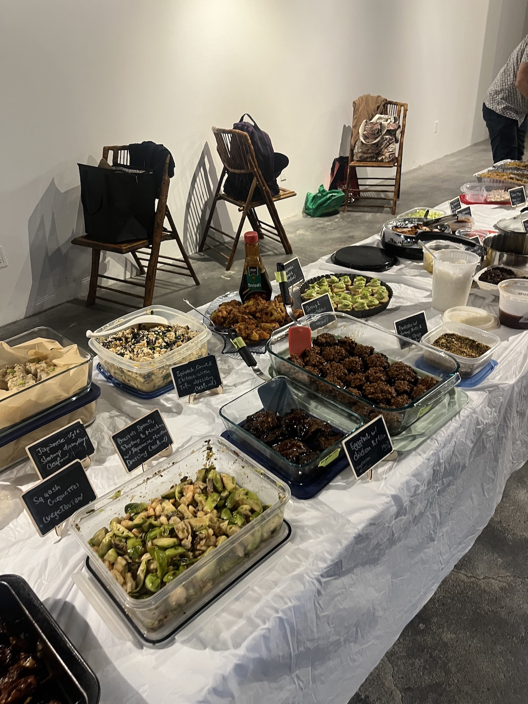
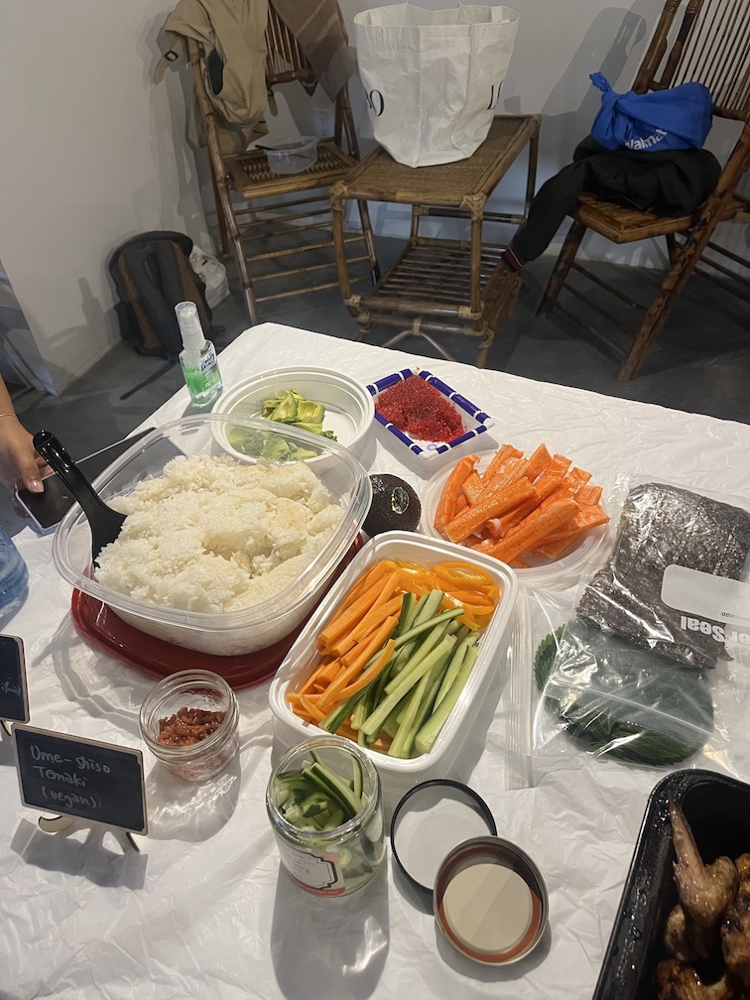

Every month our Toronto cookbook club picks one cookbook and everyone cooks from it. For September, Mady picked Mastering the Art of Japanese Home Cooking by Masaharu Morimoto. Here's what's in it and how it held up as a group cook.

## Who wrote it

Masaharu Morimoto is the chef most people know from Iron Chef, and he has restaurants under his own name in a number of cities. This book is deliberately not a restaurant book. It came out in 2016 and it is about the food he cooks and eats at home, which is a much quieter thing than what he is famous for.

## What's inside

The book opens with foundations rather than showpieces. Dashi comes first, then rice, then miso soup, and a lot of what follows leans on one of those three. It is worth reading that section even if you only plan to cook one recipe, because it explains why so many Japanese dishes taste the way they do.

You can see the foundations doing their work on the table. The dashi simmered rice with vegetables above is the front section of the book showing up as an actual dish, and next to it is the omelette with ketchup fried rice that took one of our members about four hours.

After the foundations it opens out into the dishes people recognise. Tonkatsu, grilled miso marinated fish, Japanese style curry, temaki hand rolls, fried noodles. There is also a long stretch of small plates and sides, which is the part that made the book work for a group our size.

Morimoto is opinionated in it, which I liked. A fair amount of the writing is him explaining how something is usually done and then why he does it differently.

## How it worked for a group cook

Better than almost any book we have done. September was our busiest table so far, with more than 30 dishes, and the book is a big part of why.

The range is what does it. There are recipes you can finish in twenty minutes and recipes that are a genuine project, so people could pick something that matched the Sunday they actually had. The curry and noodle trays above came in at full catering size. Other members brought a side dish that took a quarter of the time, and both were just as welcome.

It also spreads well. Small plates, mains, rice, noodles and sweets are all covered, so a full group can claim recipes without everyone landing on the same three dishes. Squash croquettes, Japanese style shrimp dumplings and Brussels sprouts with a Japanese mustard dressing all came out of the same book as the curry.

The one thing to know before you claim a recipe: dashi runs through the book. If you want to cook more than one thing from it you will be making a batch first. Nobody minded, but it is worth planning for.

## If you cook vegetarian, read the recipe twice

A few of our vegetarian members expected Japanese home cooking to be easy to navigate and found bonito, dashi, oyster sauce and meat further into the ingredient lists than they were expecting. It is all very doable, the book just does not flag it for you.

What happened on the night was that a lot of members made a second vegetarian version of their dish as well, swapping mushrooms in for the meat or a vegetarian oyster sauce for the original. The temaki station above went up as a vegan build your own setup for exactly that reason. If you are cooking from this one for a group, plan that in rather than finding it on the Saturday.

## Who this book is for

If you want to understand how Japanese food is built rather than collect recipes, this is the one. It rewards starting at the front and working out.

If you want fast weeknight dinners and nothing else, the foundations section will feel slow. You can skip it and cook straight from the middle of the book, but you would be leaving the best part on the shelf.

## Where to find it

Morimoto lists [all of his cookbooks](https://ironchefmorimoto.com/cookbooks/) on his own site. Mastering the Art of Japanese Home Cooking is also widely available through most Toronto bookstores and libraries, including the [Toronto Public Library](https://www.torontopubliclibrary.ca).

Read [how the September night actually went](/blog/japanese-sep-2026), air fryer and all. If you want to know what is next, we announce it on [Instagram](https://www.instagram.com/sautesundays.to/) and to the [newsletter list](/contact) first.
