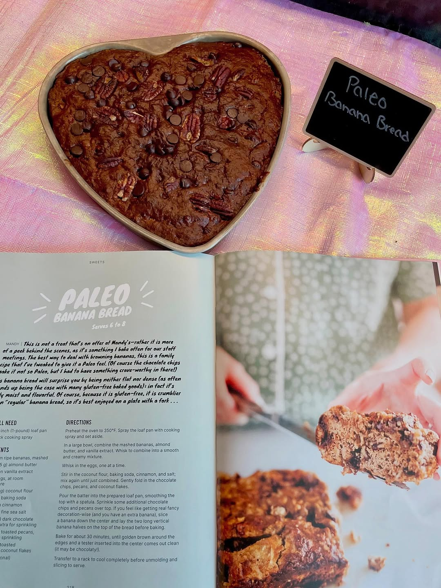
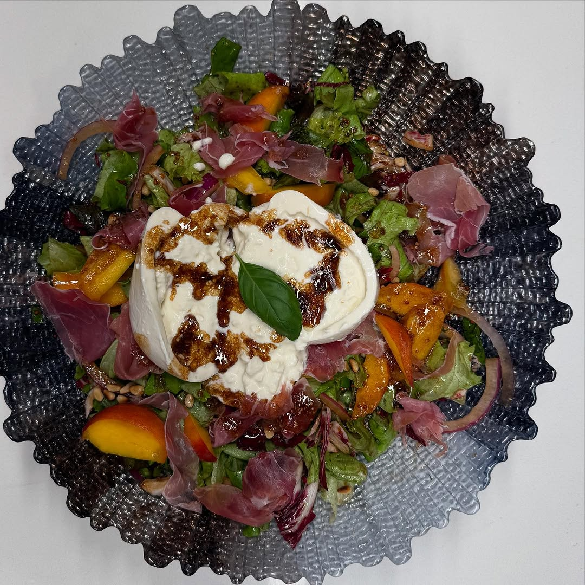
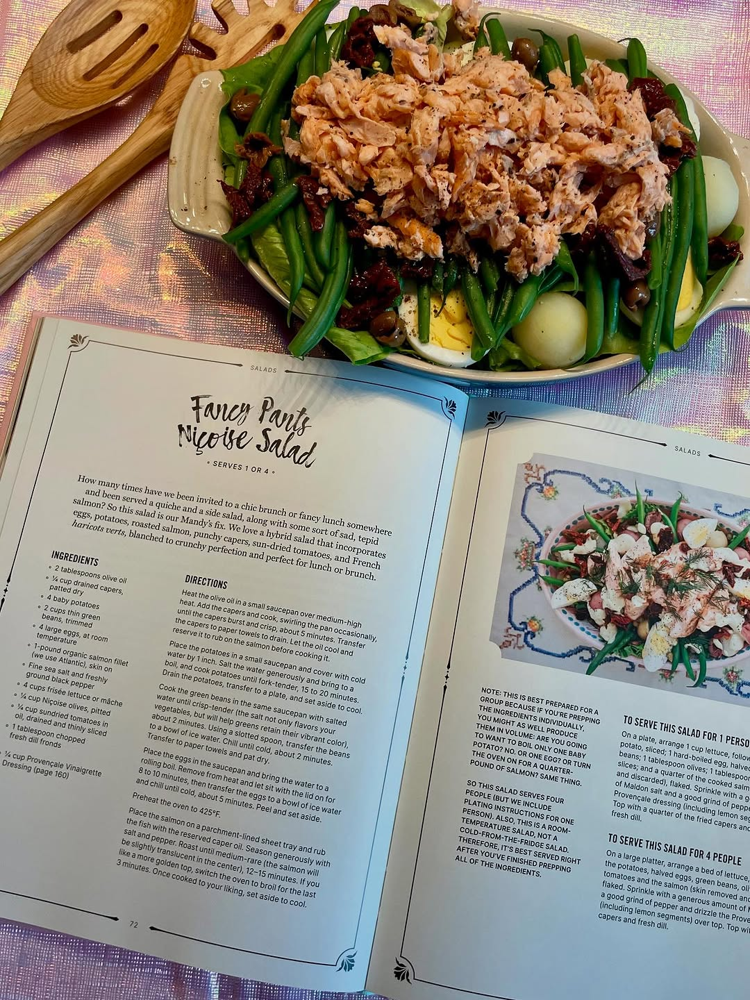
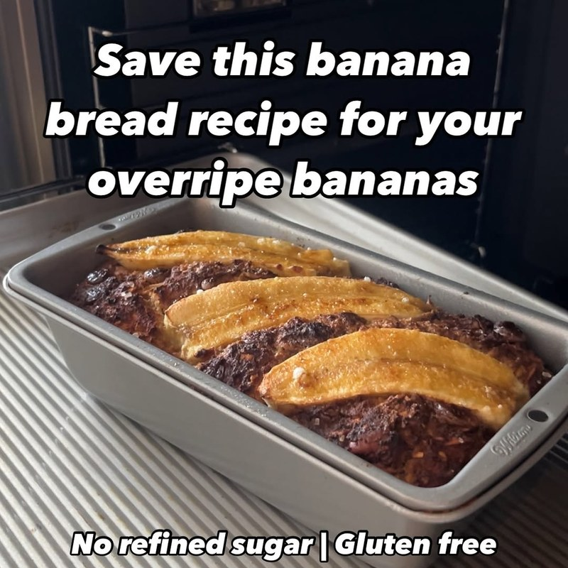
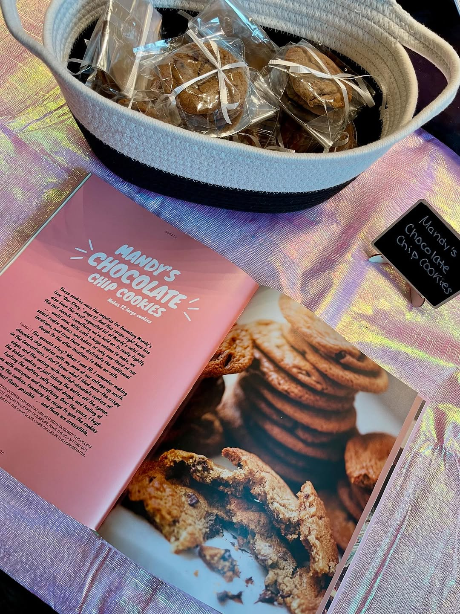

import InstagramEmbed from "../../../components/InstagramEmbed.astro";

Our first meetup ran on **Mandy's Gourmet Salads: Recipes for Lettuce and Life**, by Mandy and Rebecca Wolfe of the Montreal salad counters. On July 20, 2025, a group of strangers turned up in downtown Toronto, each carrying a dish out of it.

Salads, but the gourmet kind. That's the Wolfe Salad on the cover of this post, chalkboard name card and all.

## Peach and Prosciutto Salad

Peak summer in a bowl. Our test batch never made it as far as dinner.

- 1 cup arugula
- 1 cup shredded frisée lettuce
- 1 cup chopped radicchio
- 1 peach, cut into 6 or 8 segments
- 2 tablespoons thinly sliced red onion
- ¼ ball fresh burrata, at room temperature
- 2 tablespoons toasted pine nuts
- 2 tablespoons torn basil leaves
- 2 thin slices prosciutto
- ⅓ cup Italian Summer Dressing (also in the book)

## Fancy Pants Niçoise Salad

Exactly as fancy as it sounds, and a whole morning of prep.

- 2 tablespoons olive oil
- ¼ cup drained capers, patted dry
- 4 baby potatoes
- 2 cups thin green beans, trimmed
- 4 large eggs, at room temperature
- 1 lb salmon fillet, skin on
- Fine sea salt and freshly ground black pepper
- 4 cups frisée lettuce or mâche
- ¼ cup Niçoise olives, pitted
- ¼ cup sun-dried tomatoes in oil, drained and thinly sliced
- 1 tablespoon chopped fresh dill fronds
- ¼ cup Provençale Vinaigrette Dressing (also in the book)

The method, including what to do with those capers, is in the book.

## Paleo Banana Bread

The sleeper hit of a salad cookbook. It is gluten free, and it disappeared well before most of the salads did.

- 3 medium ripe bananas, mashed
- ¼ cup almond butter
- 1 teaspoon vanilla extract
- 2 large eggs, at room temperature
- ½ cup coconut flour
- 1 teaspoon baking soda
- ½ teaspoon cinnamon
- ¼ teaspoon fine sea salt
- ½ cup dark chocolate chips, plus extra for sprinkling
- ½ cup toasted pecans, plus extra for sprinkling
- ½ cup toasted unsweetened coconut flakes
- 1 banana (optional, for the top)

Here's ours coming together:

<InstagramEmbed url="https://www.instagram.com/p/DL8bnQ6Rhi9/" />

## Mandy's Chocolate Chip Cookies

The sweets chapter deserves as much attention as the salads.

- ½ cup packed brown sugar
- ¼ cup granulated sugar
- 2 teaspoons Maldon salt
- ½ cup + 2 tablespoons cultured unsalted butter, cubed
- 1 large egg, at room temperature
- ½ teaspoon baking soda
- 2 teaspoons pure vanilla extract
- 1¼ cups all-purpose flour
- 1 cup dark chocolate chips, chilled

## From the day

<InstagramEmbed url="https://www.instagram.com/p/DMWJdf5RaML/" />

We announced this one on a Thursday, and it was full by Friday night, which set the pattern for everything that came after.
