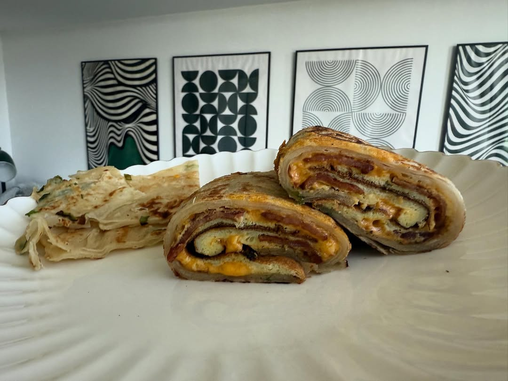
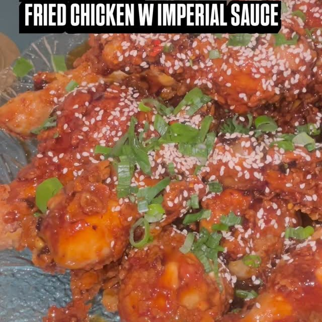
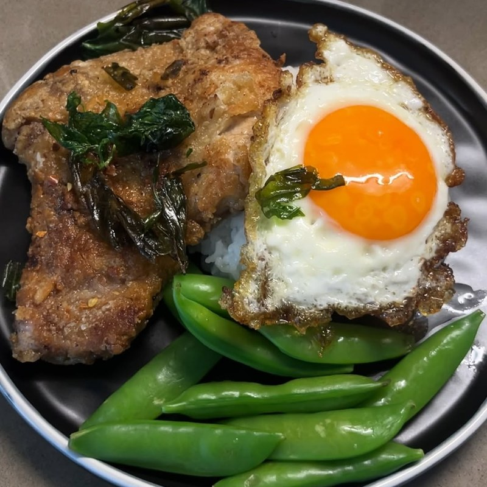
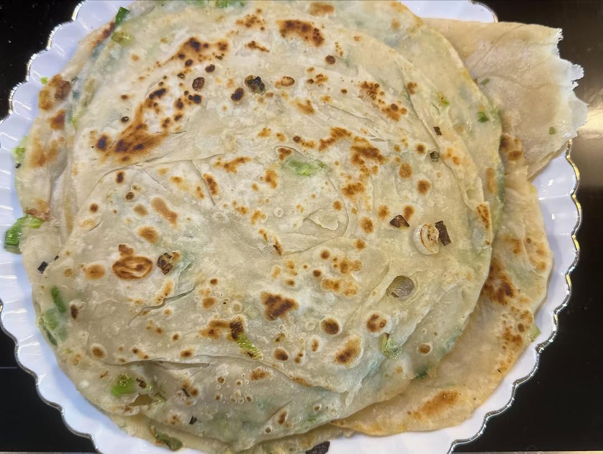

import InstagramEmbed from "../../../components/InstagramEmbed.astro";

**Win Son Presents: A Taiwanese American Cookbook** comes from Josh Ku, Trigg Brown, and Cathy Erway, out of the Brooklyn restaurant and bakery of the same name. It is Taiwanese cooking filtered through an American kitchen, and it is not shy about it. September's table did it justice.

## Fried Chicken with Imperial Sauce

We gave this one 10 out of 10 at the recipe test, and the event batch went faster still. It is a proper project: marinate, dredge, fry, then sauce.

**Marinade:**
- 2 pounds chicken thighs, drumsticks, wings, and/or breasts
- 1 cup buttermilk
- ½ cup Frank's RedHot sauce
- 1 tablespoon each: powdered ginger, garlic powder, Chinese five-spice, cayenne, curry powder
- 2 teaspoons each: Chinese hot mustard powder, smoked paprika
- 2 tablespoons cornstarch
- 1 tablespoon neutral oil
- 1-inch piece fresh ginger, sliced
- 1 bunch scallions, roughly chopped

**Dredge:**
- ½ cup cornstarch
- ½ cup all-purpose flour
- 1 cup coarse sweet potato starch
- 1 tablespoon salt
- 1 tablespoon MSG

**Imperial sauce:**
- ½ cup kecap manis
- ½ cup oyster sauce
- 2 tablespoons chili oil (the book's House Chili Oil, or Lao Gan Ma)
- 1 tablespoon each: mirin, light soy sauce, Chinese black vinegar
- 2 tablespoons toasted sesame oil

You will also need 2 quarts of neutral oil for frying, plus sesame seeds and scallions to finish.

<InstagramEmbed url="https://www.instagram.com/p/DOoWeKMERXp/" />

## Fried Pork Chops with Basil

Heavy on the five-spice and dangerously easy to pick at straight from the pan.

- 8 pork collar steaks or chops, sliced about ¼ inch thick
- 3 tablespoons shio koji
- 1 tablespoon salt
- 2 teaspoons Chinese five-spice powder
- 2 tablespoons rice vinegar
- 2 teaspoons sugar
- 2 tablespoons light soy sauce
- 1 teaspoon toasted sesame oil
- 4-inch piece fresh ginger, minced
- 3 cloves garlic, minced
- 1 cup sweet potato flour, for dredging
- 1 bunch Thai basil leaves
- Neutral oil for frying, plus the book's five-spice and chile finishing salt

Serve it over rice with a sunny-side-up egg, the way the book does.

## Scallion Pancakes

Properly flaky, and responsible for converting at least one member into making them from scratch forever.

- 4 cups all-purpose flour
- 1½ cups tepid water
- 2 teaspoons salt
- 1 teaspoon MSG
- 4 tablespoons melted pork lard, shortening, or butter
- 1 bunch scallions, thinly sliced
- Neutral oil for pan-frying
- Sweet Soy Dipping Sauce (also in the book)

## From the night

<InstagramEmbed url="https://www.instagram.com/p/DPAEjTOkfHH/" />

Three more from the book made it to the table that night: the Big Chicken Buns with fu ru mayo, the Green Soybean, Tofu Skin, and Pea Shoot Salad, and the Braised Beef Shanks.
