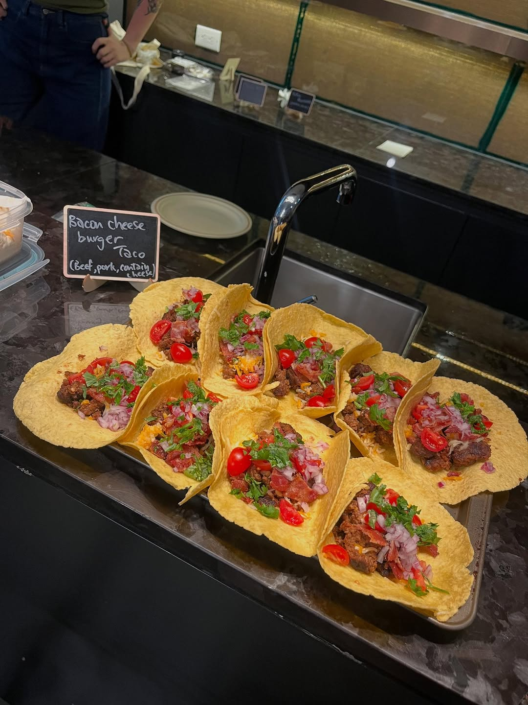
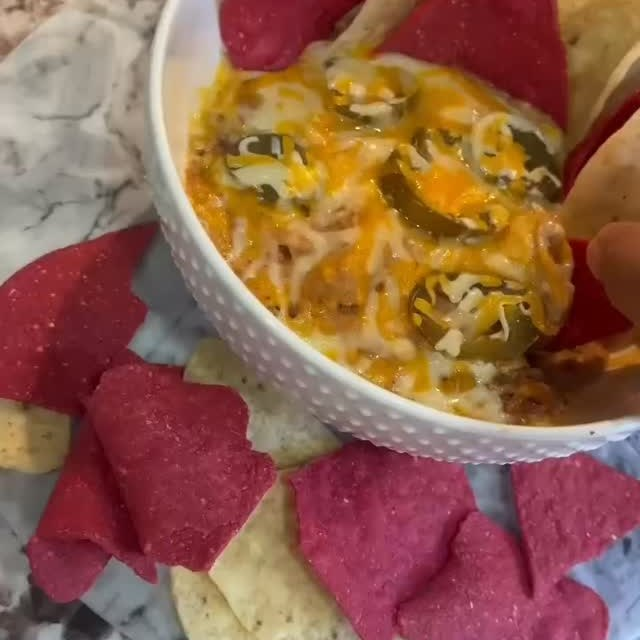
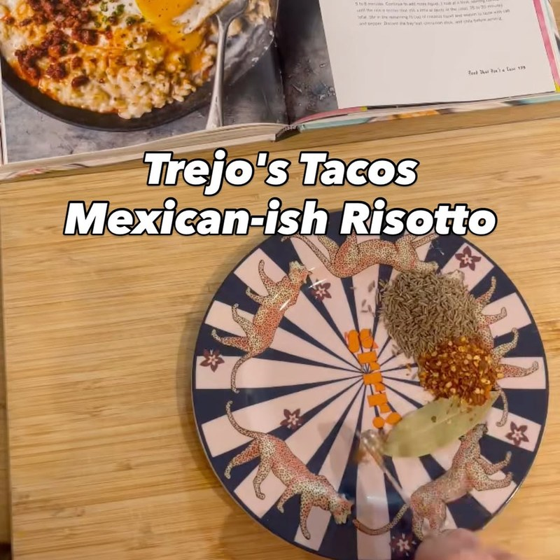
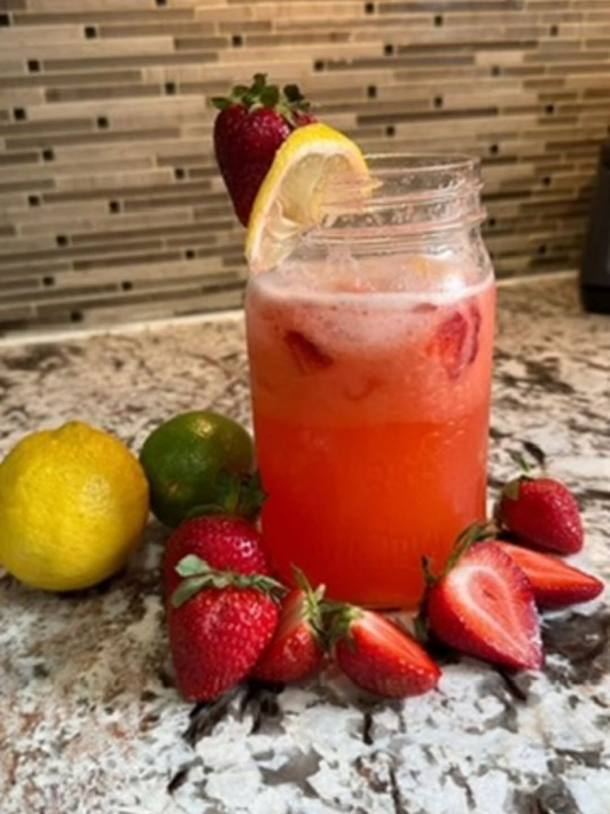
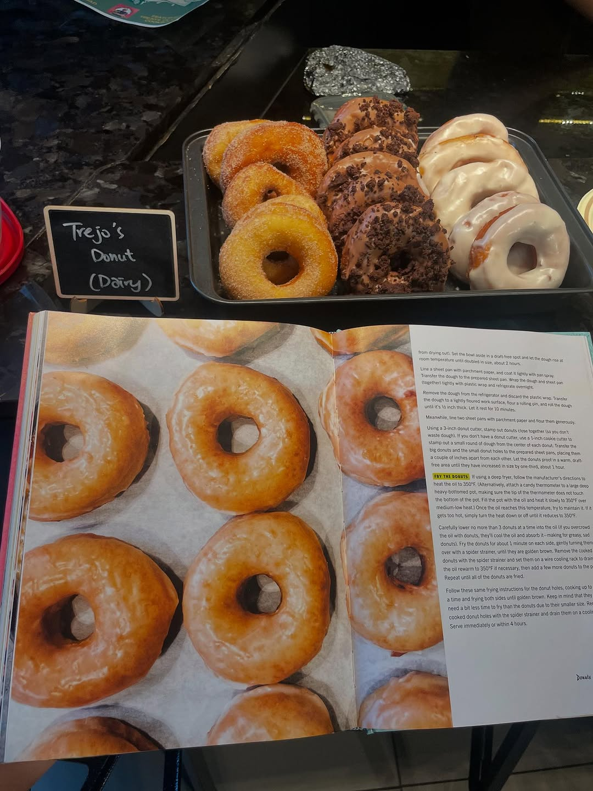

import InstagramEmbed from "../../../components/InstagramEmbed.astro";

**Trejo's Tacos: Recipes and Stories from L.A.** is Danny Trejo writing about the food of his hometown. Most of it is built as master recipes that spin out into tacos, burritos, and bowls, and then there is a whole donut chapter, because Trejo runs a donut shop too.

August was our first evening meetup, and the table turned into a build-your-own taco bar.

## Barbacoa Brisket

The anchor of the whole table. It starts the day before.

**Dry brine:**
- ½ cup sugar
- ½ cup kosher salt
- 4 garlic cloves, finely chopped
- 2 tablespoons freshly ground black pepper
- 2 teaspoons ground cumin
- 4 to 5 pounds beef brisket

**Browning and braising:**
- 2 tablespoons vegetable oil
- 1 medium yellow onion, thinly sliced
- 1 garlic clove, roughly chopped
- 1 tablespoon chili powder
- 2 teaspoons ground coriander
- 2 teaspoons ground cumin
- ¼ cup apple cider vinegar
- 1 can (14½ oz) whole peeled tomatoes, with juices
- 2 chipotle chiles in adobo, chopped
- 2 dried bay leaves
- ¼ cup molasses

## Cheesy Bean Dip

The appetizer that never made it to the main course.

- 1 can (16 oz) refried beans
- ½ cup cream cheese, at room temperature
- 1 cup shredded Mexican-style cheese blend
- 1 tablespoon chopped pickled jalapeños
- 1 tablespoon pickled jalapeño juice
- 1 tablespoon crumbled Cotija
- Hot sauce (optional)

## Mexican-ish Risotto

The same creamy comfort as the Italian kind, but with chile and a hint of cinnamon. It was the dish nobody expected to find in a taco book.

- 1½ cups full-fat coconut milk
- 2 tablespoons olive oil
- 2 cups short-grain brown rice
- ½ cup chopped white or yellow onion
- 2 garlic cloves, chopped
- 1 tablespoon cumin seeds
- 1 dried bay leaf
- ½ cinnamon stick (or ¼ teaspoon ground)
- 1 whole dried chile de árbol
- Kosher salt and freshly ground black pepper

<InstagramEmbed url="https://www.instagram.com/p/DN1ZQ2L4s9u/" />

## Strawberry Lemonade

Our answer to that week's heat wave.

- 1 pound fresh strawberries, hulled
- 2 cups fresh lemon juice (8 to 10 lemons)
- 1 cup sugar
- Lime slices, for garnish

## The Lowrider (Raised Donuts with Cinnamon Sugar)

Someone made yeast donuts from scratch and brought them to a potluck. The Lowrider is the cinnamon sugar one, built on the book's Trejo's Donuts dough.

- ½ cup buttermilk
- 2¼ teaspoons active dry yeast
- 4 cups sifted all-purpose flour
- Scant ½ cup sugar, plus 1 cup for the cinnamon-sugar coating
- 2 teaspoons kosher salt
- 1 stick unsalted butter, at room temperature
- Scant ¾ cup full-fat sour cream
- 3 large eggs, beaten
- 1 teaspoon vanilla extract
- 1 teaspoon ground cinnamon (for the coating)
- Vegetable oil, for frying

## From the night

<InstagramEmbed url="https://www.instagram.com/p/DOHN4jrgN20/" />

Also on the table, all of it out of the same book: Gringo Tacos, Mushroom Asada, Mexi-Falafel Tacos, Chicken Tikka Tacos, and Mexican Hot Chocolate Cookies.
