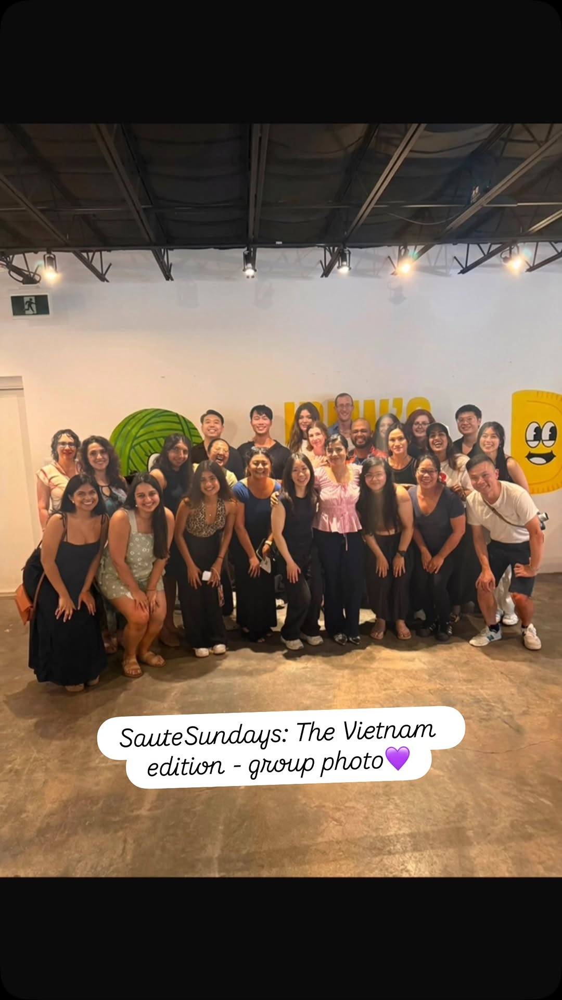
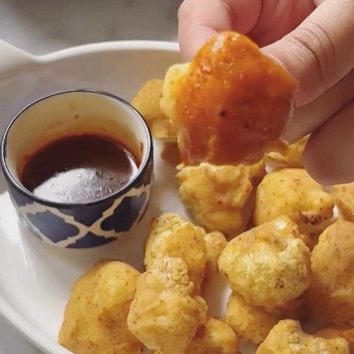
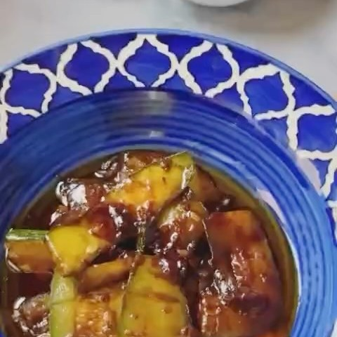
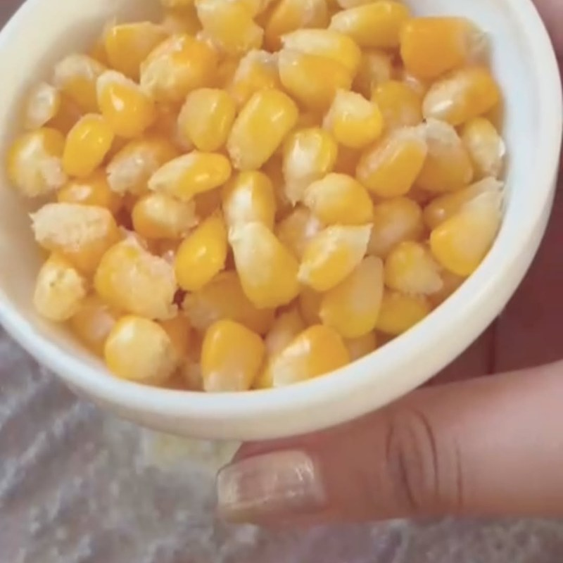

import InstagramEmbed from "../../../components/InstagramEmbed.astro";

**Vietnamese Food Any Day** by Andrea Nguyen is built on one promise: proper Vietnamese flavour out of a regular supermarket. That is why we billed July as the Stress Free Edition. It was the middle of a Toronto summer, and nobody wanted to spend a Sunday hunting for ingredients.

Everyone already knows pho and banh mi. It was the quieter dishes that won people over.

## Roasted Cauliflower "Wings"

Battered and baked rather than fried, then glazed in chile garlic sauce. We kept making these long after the recipe test was over.

- 1 to 1¼ pounds cauliflower florets
- Scant 1¼ cups rice flour
- 1 teaspoon fine sea salt
- ¼ to ½ teaspoon black pepper
- 1¼ teaspoons paprika
- Brimming ⅔ cup water
- 2½ tablespoons neutral oil
- 1 tablespoon sugar
- 1 tablespoon Bragg Liquid Aminos, Maggi, or soy sauce
- 3 tablespoons chile garlic sauce (the book's homemade, or store-bought)
- ¼ cup light corn syrup or brown rice syrup

<InstagramEmbed url="https://www.instagram.com/p/Da1K2AEv2am/" />

## Easy Soy Sauce-Glazed Zucchini

Six ingredients and one pan, which is the whole thesis of this book in a single side dish.

- 1 pound zucchini
- ½ teaspoon fine sea salt
- 2 teaspoons neutral oil
- 1 garlic clove, smashed
- 1½ teaspoons soy sauce, Bragg, or Maggi
- 1 teaspoon chile garlic sauce or sambal oelek (optional)

## Vietnamese Iced Coffee with Condensed Milk

Made during a heat wave, which is the correct time to make it.

- 3 tablespoons ground dark roast coffee (Café Du Monde is the classic)
- About ⅔ cup hot water
- 2 tablespoons sweetened condensed milk
- 4 or 5 ice cubes

## Streetside Corn and Chile

Bắp xào, the buttery street corn with fish sauce and chile. The book cooks it in a skillet. Ours went on the grill, with Ontario sweet corn at the peak of its season.

- 1½ tablespoons unsalted butter or virgin coconut oil
- 2 cups fresh corn kernels
- 1 fresh chile (Fresno or jalapeño), seeded and chopped
- 2½ teaspoons fish sauce
- Rounded ¼ teaspoon smoked paprika
- 1 green onion, thinly sliced
- 1½ teaspoons furikake or crumbled toasted nori

## From the night

<InstagramEmbed url="https://www.instagram.com/p/DbBdW7YxjJF/" />

Thanks again to Jrew's for the space. If you want to know which book is next, we announce it on [Instagram](https://www.instagram.com/sautesundays.to/) and to the newsletter list first.
