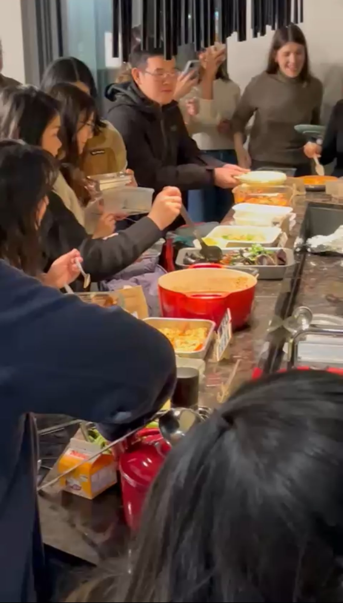
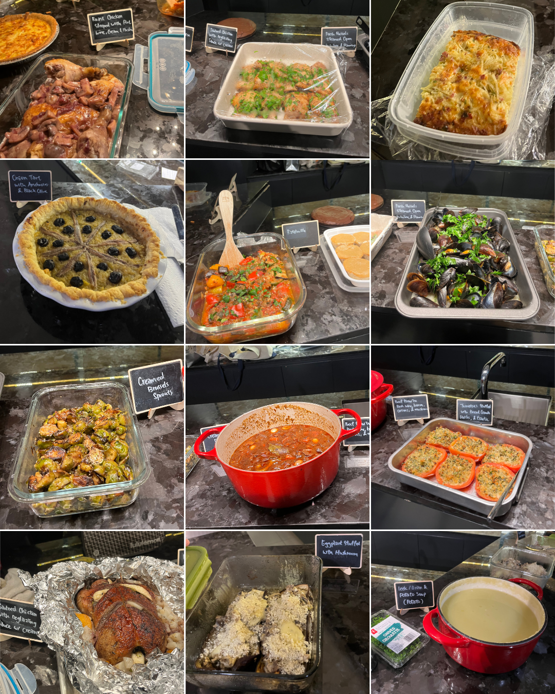
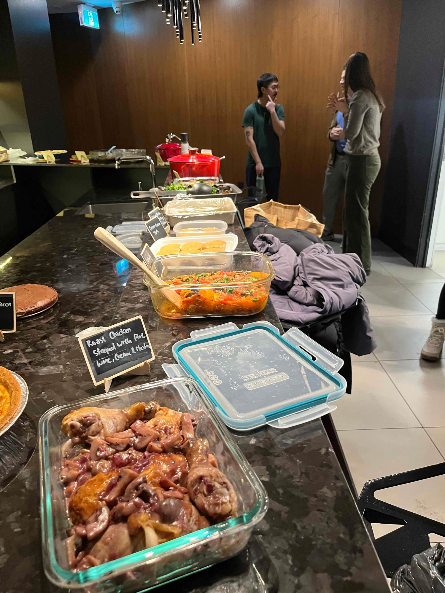

We picked the most intimidating cookbook we have done so far, in the coldest month of the year, and it was exactly the right call. *Mastering the Art of French Cooking* is the Julia Child book, written to teach technique to people with no French kitchen behind them, and it does not let you rush. Every recipe has a step where you either commit or you do not. January is the one month when nobody minds spending a whole afternoon on dinner.

The table read like a table of contents. A beef stew in red wine with bacon and mushrooms in a red pot at the centre. Roast chicken steeped in port and cream. Mussels steamed open in wine and buried under parsley. Ratatouille, creamed brussels sprouts, tomatoes stuffed with breadcrumbs and herbs, and a leek and potato soup that stayed warm all evening. My favourite thing on it was Emma's onion tart, laid out with anchovies and black olives in a proper spoked pattern that somebody had clearly stood over for a while.

Most of the conversation was technique. How long things took, what went wrong the first time, what everyone would do differently. That is the conversation this book is designed to produce, and you do not get it from a weeknight recipe.

A proper cold weather table, and worth every hour it took.

We run one of these every month. [Subscribers get the link](/contact) before spots open to everyone.

