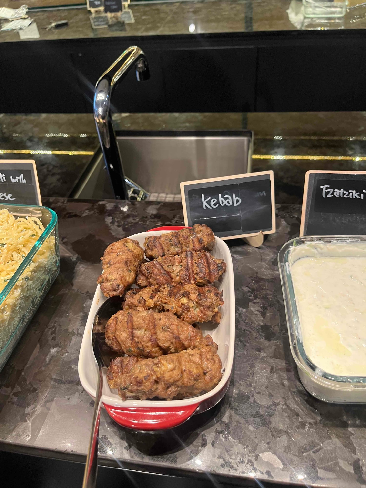
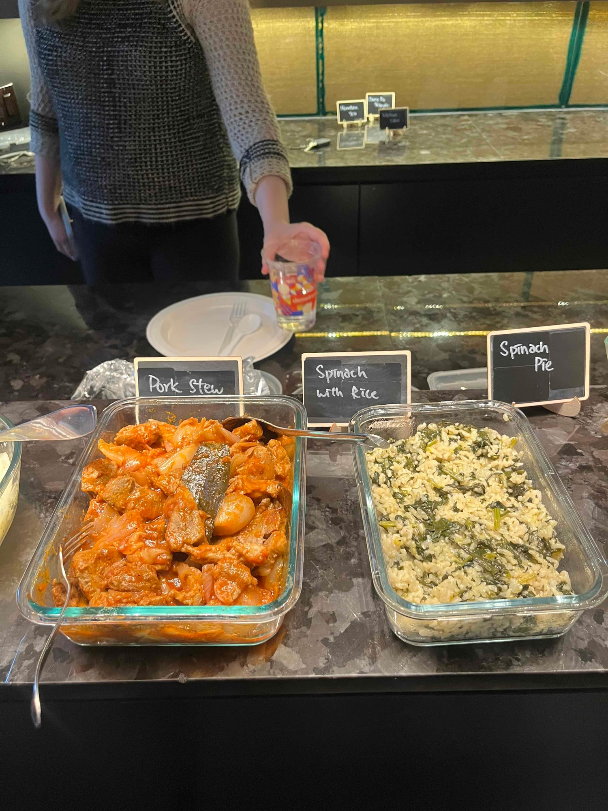
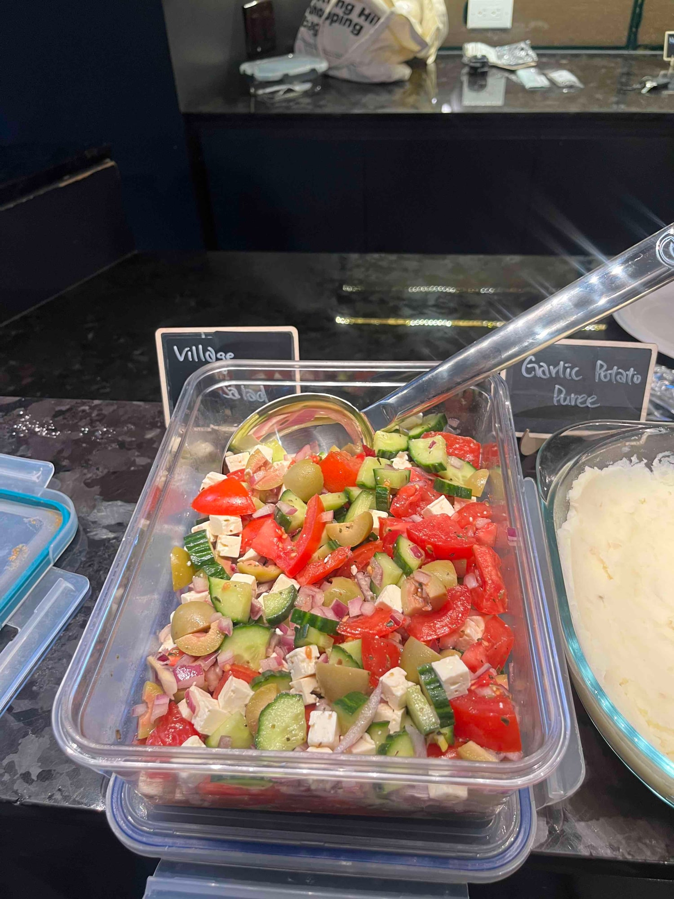
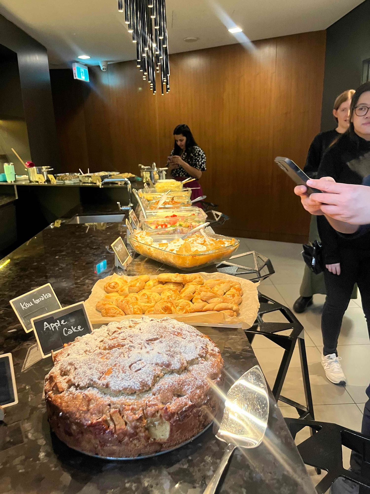
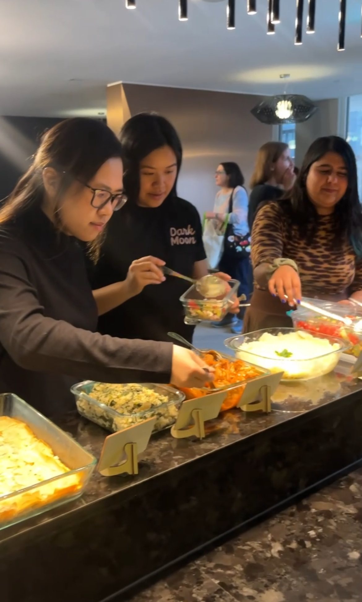
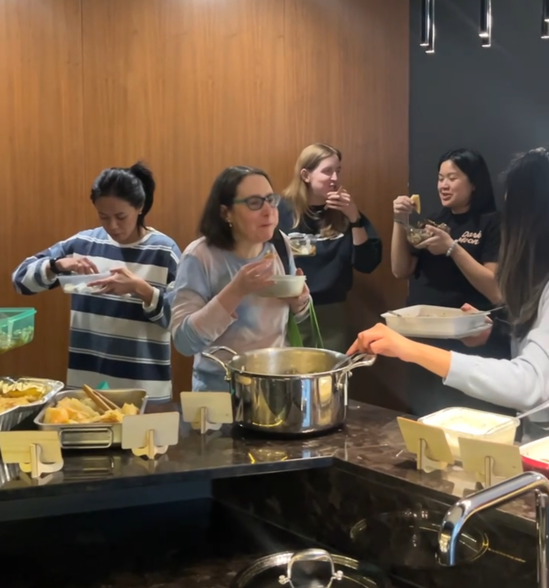

*My Big Fat Greek Cookbook* was the pick for March, and it is a good example of a book that reads easier than it eats. Greek cooking looks deceptively simple on paper. Olive oil, lemon, oregano, a short ingredient list. Then you taste six versions of it side by side and realise how much room there is inside those constraints.

This was one of our fuller tables. Kebabs, a pork stew, spinach and rice doing the quiet work every table needs, and a lot of bread, none of which survived. The mezze approach helped. Nothing needed plating properly, so everything went down the middle and stayed there, and people just kept reaching.

Dessert was the best part. Karen made an orange cake and Clarice made an apple one, and between them they were my favourite thing anyone brought that night. I liked the orange one enough that I made it again myself later, for my birthday.

This might be the most popular month we have run. People went and bought the book afterwards, because the recipes are so easy for how good the results are. That is the highest compliment a month can get. Nobody buys a cookbook because a night was fun. They buy it because they want to make the thing again at home.

March is when Toronto starts to turn, and this felt like the first table of the year looking forward rather than hunkering down.

We run one of these every month. [Subscribers get the link](/contact) before spots open to everyone.

