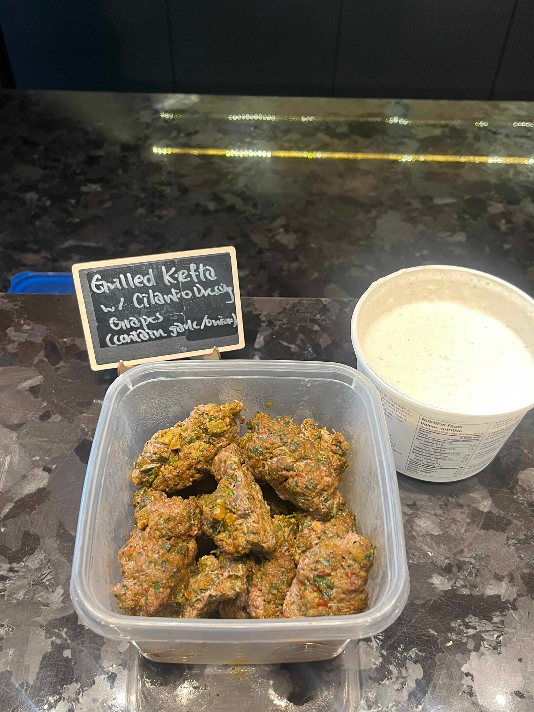
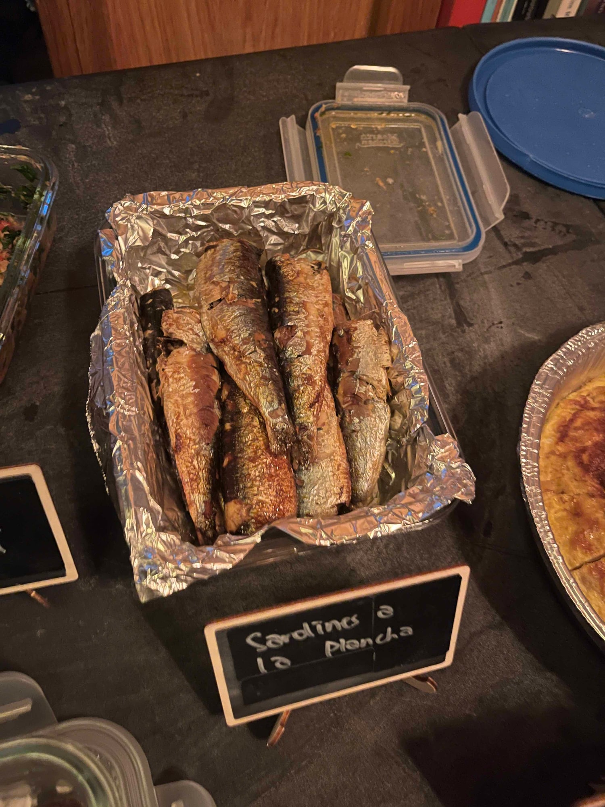

import Nights from "../../../components/Nights.astro";
import { REACH } from "../../../config/theme.config.ts";

When Mady and I started Sauté Sundays in 2025, it was nine people in the party room of my building. <Nights /> events later, we open {REACH.seats} seats a month at Jrew's in downtown Toronto, there are usually around 20 people on the waitlist, and a few nights have sold out to our newsletter before we'd even announced them publicly, one of them in three hours.

Starting a cookbook club takes less than most people think: a group of people, a cookbook, a way for everyone to claim a different recipe, and somewhere to put all the food. Our first night had all four and not much else.

Most guides on this assume you're cooking with four to six friends. Ours is open to anyone, so a lot of what we've learned is about running a cookbook club with people who don't know each other yet. Here's how we run Sauté Sundays, our Toronto cookbook club, and what we'd do differently if we were starting over.

If you're new to the idea, a cookbook club is a group where everyone cooks a different recipe from the same book and then shares it all. Our [cookbook club guide](/blog/cookbook-club) covers how they work and what to expect as a guest. This one is for organizers.

## How many people do you need to start a cookbook club?

We started with nine, mostly because nine was who we had, and it turned out to be a really good size for testing the idea. With a small group you find out fast whether people actually enjoy the format, how much food everyone needs to bring, what your space can handle, and which parts of organizing take way more work than you expected.

It also gives you a chance to figure out what kind of night you want before strangers start showing up. If you're planning to open your club to the public later, a few small nights first is the easiest way to learn what breaks while the stakes are low.

## What format should your cookbook club use?

Pick your format before the first invite goes out. The big decisions are whether you follow one cookbook or a looser theme, and whether it's a private group or open to anyone. There's no right answer to either, but they're awkward to change once people have expectations. Some clubs cook together in one kitchen, but honestly, getting a whole group cooking in the same space is really hard to pull off in real life, which is why ours is a potluck.

Our version is pretty simple. Each month we pick one cookbook, everyone claims a different recipe, cooks it at home and brings it to share. It's open to anyone in Toronto, and [newsletter subscribers](/contact) get early access before we release spots publicly, so the people who've been following along get first dibs.

## How often should a cookbook club meet?

We run one night a month, mostly because I work full time and that's what we can realistically pull off. If you're running a club around a day job too, once a month is plenty. Whatever you choose, leave enough time between nights for people to get hold of the book, pick a recipe and plan a shopping trip, and keep the schedule predictable so people can plan around it.

## How do you choose a cookbook for a cookbook club?

Honestly, a lot of our picks start with Mady or me craving a certain cuisine. Members suggest books too, and sometimes we put a shortlist to a vote in our WhatsApp group. There's no formula, but after [more than a dozen books](/categories/cookbook-highlight) there are a few things we always check before committing:

- enough recipes for everyone to claim a different one, which with 35 people rules out some slimmer books
- a mix of mains, sides and desserts, so the spread doesn't end up being all dips
- vegetarian options and room to work around common allergies
- ingredients people can find without a special trip across the city
- a handful of recipes a nervous cook can pull off

Nobody needs to own the book. A lot of our picks are on Libby, and people borrow from friends or flip through a copy at the bookstore. We do encourage buying it if you can, since it supports the author.

## How do you organize recipe sign ups so nobody brings the same dish?

Make a recipe index before anyone claims anything. Ours is a shared Google Sheet that lists every recipe in the book by chapter, with the page number, dietary notes, a rough difficulty rating, and a column for the name of whoever's making it. The link goes out in the confirmation email when someone RSVPs, and they just put their name next to the dish they want.

Whatever tool you use, everyone needs one place to check. People need to see which recipes exist, which are already taken and who's making what, without messaging you to ask. It also saves you from answering the same question 30 times.

We set a deadline to claim a recipe, send a reminder before it closes, and close sign ups 12 hours before the event. If someone still hasn't picked by then, their spot goes to the waitlist.

## How much food should each person make?

We ask for 6 to 8 portions. That sounds small for a room of 35, but nobody eats a full serving of anything when there are around 30 dishes to try. Everyone takes a spoonful of a lot of things, so 6 to 8 portions of each dish goes around. If your group is smaller, ask for bigger batches, since there are fewer dishes filling each plate.

## How do you handle allergies at a cookbook club?

Build allergy information into the recipe index from the start. Every dish in our sheet has its allergens flagged, with a vegan or vegetarian label where it applies, and people tell us about their own allergies when they RSVP. Members with serious allergies get called out at the top of the sheet so everyone cooking knows to be careful.

This was one of our biggest lessons. Sorting out dietary information after 35 people have already picked their dishes is a lot messier than having it there before anyone chooses. It's still a public food sharing event, so we ask anyone with allergies to message us and take their own precautions too. We can flag what's in each recipe, but we can't promise what happened in 35 different kitchens.

## Will strangers actually talk to each other?

This was my biggest worry when we opened Sauté Sundays to the public, and it mostly took care of itself. Everyone walks in with something to talk about. What did you make? Was it hard? Did yours look anything like the photo? Would you make it again? You really don't need icebreakers when there are 35 dishes waiting to be asked about. We also never do forced networking. So many events in Toronto turn into career chat and swapping LinkedIns, and we keep that out on purpose so the conversation stays on the food.

It helps that Mady and I are good at different things. I handle most of the logistics, from the sign up sheet to the emails, and Mady is much better at the social side of the night. If you have someone hosting with you, you don't both need to be good at everything, so split it by what each of you actually enjoys.

## How do you make nervous cooks feel welcome?

People at their first night almost always worry their dish won't be good enough, so we say it plainly in our event descriptions: it's not a competition. A recipe that went a bit sideways is just as fun to talk about as one that came out perfect, and people relax once they know that going in.

Every few months we also run a night aimed at beginners, our [Stress Free edition](/blog/cookbook-vietnamese-july-2026), with a book picked for simple techniques and everyday ingredients. It gives people who've been curious but unsure an easy month to try it. Our [cookbook club guide](/blog/cookbook-club) covers what that first night is like from the guest's side.

## What do you do when people cancel?

Expect it and build your RSVP system around it, because the number of people who RSVP and the number who walk in the door are rarely the same. At one recent event, 57 people signed up for our 35 seats, counting everyone who cancelled before the night. 30 of them were new to Sauté Sundays. At headcount, 10 new people had actually come. The gap was cancellations, a lot of them late, and it's the reason we always keep a waitlist. We usually start with around 20 people waiting, and by event day that's down to about 10 as spots open up and people get moved in.

We also overbook a little now, because there are always cancellations close to the event, and finding replacements that late is hard. People already have other plans, or it's too late for them to pick a dish and shop for it. Making everyone claim a recipe helps too. It's a free event, so cancelling costs nothing, but once someone has written their name next to a dish, they're a lot less likely to drop off.

We run all of this through [Luma](https://lu.ma/sautesundaysto), which handles RSVPs, the waitlist, a short questionnaire when people sign up, and reminders before the event. It's also how newsletter subscribers get early access, and a lot of new people find us through Luma's Toronto event listings. To keep things fair, anyone who cancels last minute goes to the back of the line for early access next time. It costs nothing and so far it's worked.

## What tools do you need to run a cookbook club?

For a first night with nine people, a group chat and a spreadsheet is plenty. These are what we use now that we're running it every month for 35:

- **Luma** for RSVPs, the waitlist, reminders and early access for subscribers
- **Google Sheets** for the recipe index
- **WhatsApp** for our community chat between events, including cookbook votes
- **Tally** for feedback forms, newsletter sign ups and partnership enquiries
- **Our website** as the home base for recaps, photos and the [FAQ](/faq)

You don't need any of this on day one. Add a tool when a job starts eating too much of your time.

## What do you need to plan for on the day?

This is the unglamorous part, and it's what people ask us about most before their first night. Before every event, think through:

- where all the food goes once 35 dishes arrive
- whether there's anywhere to warm things up, which is one of the questions we get asked the most
- serving utensils for each dish (our guests bring one for their own)
- plates and cutlery (we ask everyone to bring their own to keep it sustainable)
- labels so people know what each dish is and what's in it
- fridge space for anything that needs to stay cold
- containers for leftovers
- cleanup, and who's doing it

Ask your venue early about warming and fridge space especially, since the answer changes what people should cook. The party room in my building has a fridge we can use, but there isn't always space at Jrew's.

## How do you keep people coming back?

Ask people what they want next and actually use it. We keep a feedback form in our Instagram bio and on our website, but we never push anyone to fill it in. Most people just tell me during the event, and I save everything in the notes app on my phone. Some of our cookbook picks have come straight from those conversations, and I think having a say in what happens next is a big part of why people keep showing up.

About {REACH.attendees} people have come to Sauté Sundays since 2025, and nearly half have come back. One person has been to 10 nights, another to 9, and two more to 7. There are still new faces at every event, and our community has grown to {REACH.community} people.

## What we'd do differently if we started Sauté Sundays again

Looking back over <Nights spell={false} /> events, this is what we'd tell ourselves at the start:

1. Put allergy information in the recipe index from day one.
2. Skip the forced networking. The food gets people talking on its own.
3. Split hosting by strengths early, so neither of you ends up doing everything.
4. Plan for RSVPs to change: overbook a little and have a waitlist ready before you need one.
5. Say clearly from the beginning that it's not a cooking competition.
6. Don't overthink the cookbook. Picking something you're genuinely excited about goes a long way.

## How to start a cookbook club in 10 steps

1. Decide your format: one book or a theme, private or open.
2. Pick a date and a venue.
3. Choose your first cookbook.
4. Invite people.
5. Build a recipe index with dietary notes and allergens.
6. Collect allergies from everyone attending.
7. Set a deadline to claim recipes and send reminders before it.
8. Sort out food logistics with your venue.
9. Host the night.
10. Ask for feedback and use it to pick the next book.

## Would you rather join one first?

If running a club isn't for you, or you want to see how one works before starting your own, read our [cookbook club guide](/blog/cookbook-club) on how they work and what to expect. And if you're in Toronto, come to Sauté Sundays. We host a night every month, and [newsletter subscribers](/contact) hear about the next cookbook before anyone else.
