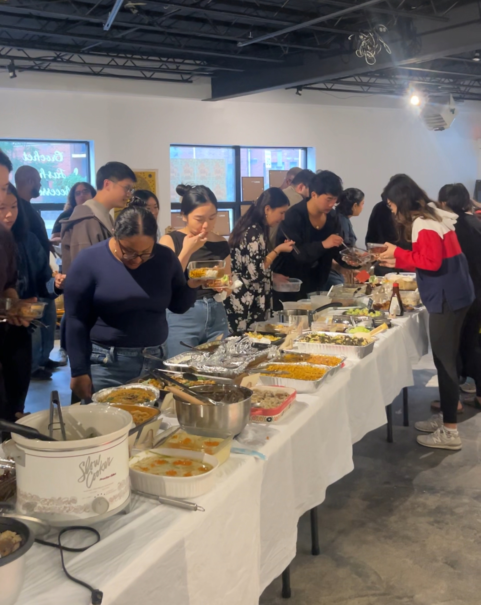
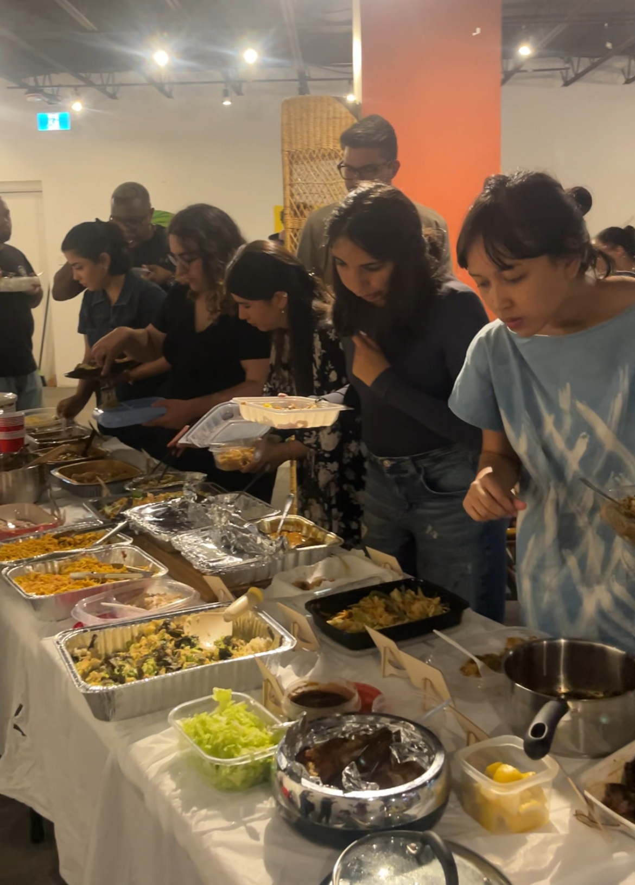
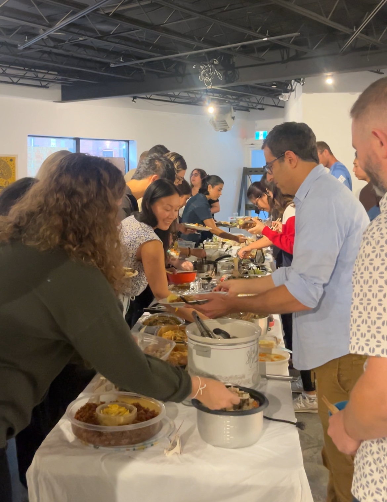

September was *Mastering the Art of Japanese Home Cooking* by Masaharu Morimoto, picked by Mady for the month, and it ended up being one of our busiest tables so far. Japanese food is always popular, but I was still surprised by how much everyone committed to this one.

There were more than 30 dishes by the end of the night, although I stopped counting properly at some point. We had chicken teriyaki, skewers, miso fish, egg custard, a DIY sushi hand-roll setup, lots of rice dishes and side dishes, plus trays of curry and stir-fried noodles that took up most of the remaining table space.

The food ran the whole length of the table and people just kept moving down it. Rice cookers and slow cookers were still plugged in, and someone even brought an air fryer so they could heat their dish up properly before serving it. People were also bringing much bigger portions than usual, including full trays of rice and curry and two trays of stir-fried noodles, so by the time everyone arrived we were trying to work out where anything else could possibly go.

One person told me they had spent around four hours making the Omuraisu, which probably summed up the level of effort people put into this month. There were a lot of dishes that clearly took a long time to prepare, but people still carried them across the city and brought enough to share with the whole room.

Japanese home cooking also turned out to work really well for the way we eat at Sauté Sundays. A lot of the dishes were easy to share and easy to go back to, so instead of everyone trying to build one huge plate at the beginning, people kept returning to the table for a second or third round and trying things they had missed earlier.

One thing that stood out to me this month was how people handled the vegetarian dishes. A few of our vegetarian members had expected Japanese home cooking to be fairly easy to navigate, but once we started looking more closely at the recipes there was bonito, dashi, oyster sauce and meat in more dishes than people first realised.

What I noticed during the night was how many members had made a separate vegetarian version of their dish as well. Some swapped the meat for mushrooms, some replaced oyster sauce with a vegetarian version, and some had basically made the same recipe twice so there would be another portion that someone else at the table could eat. There were quite a few dishes with a vegetarian version sitting beside the original, and I think that says a lot about how the group has changed as people have got to know each other.

We ran out of room on the table before we ran out of dishes, which is the correct problem to have.

Sauté Sundays is a free monthly cookbook club in Toronto. We choose one cookbook, everyone picks a recipe to make at home, and then we bring everything together around the table.

[Subscribers get the link](/contact) before spots open to everyone.
