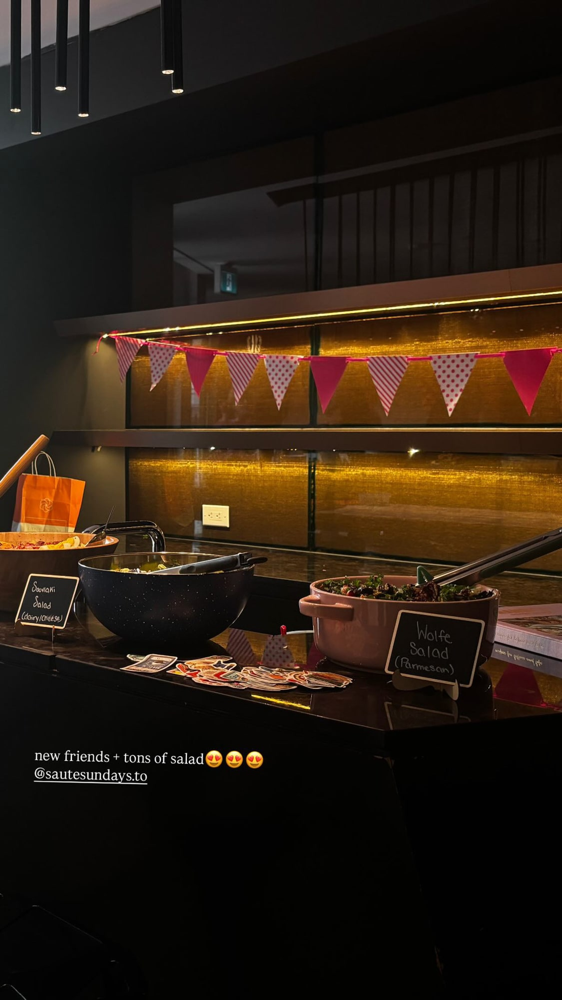
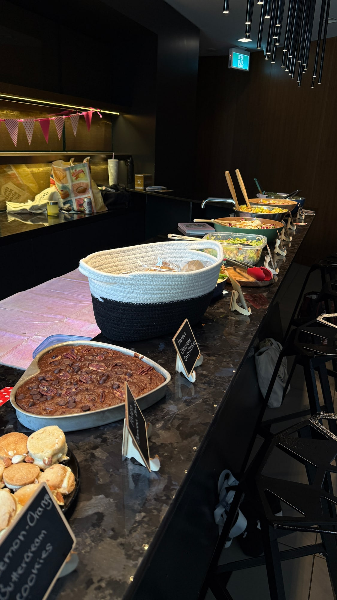
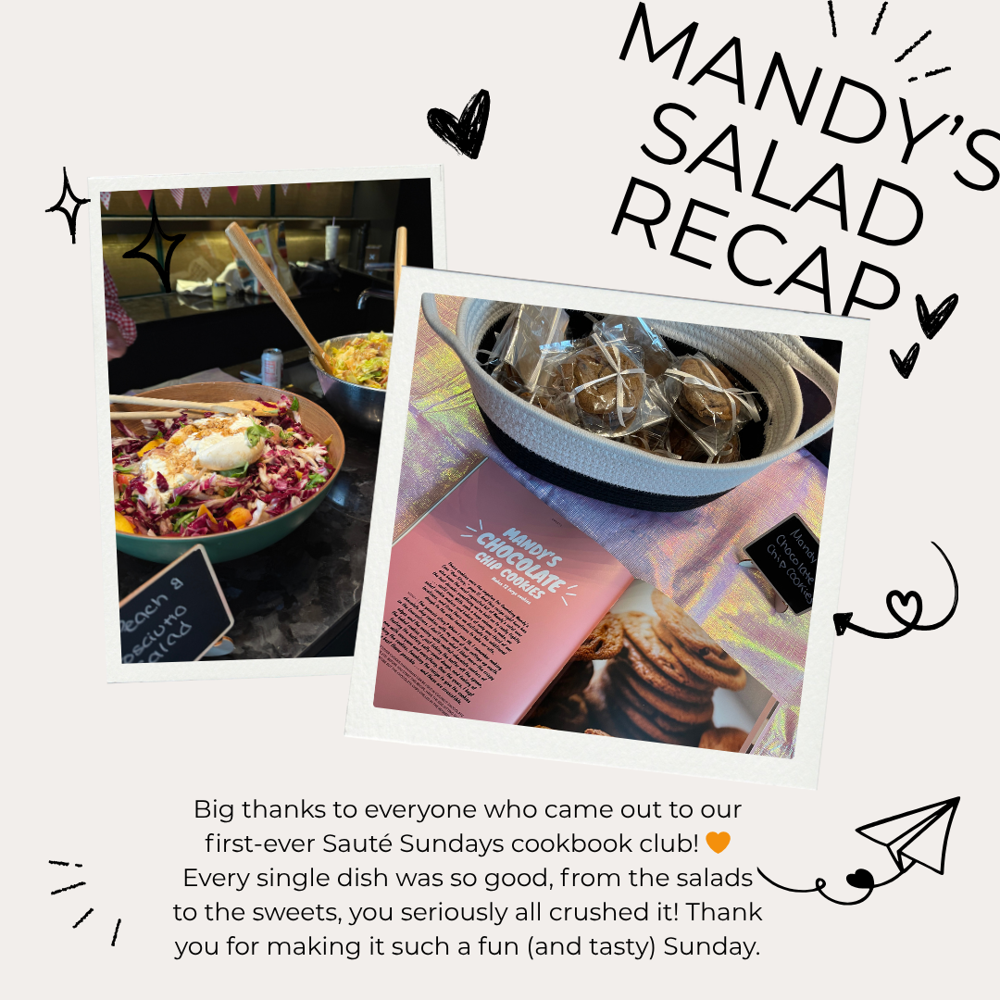

We started with *Mandy's Gourmet Salads*, the book from the Wolfe sisters behind the Montreal salad bars. It is not a health book. It is a book about making a salad the most generous thing on the table, which is exactly the argument we wanted to test in July.

The bowls arrived enormous. Peaches and prosciutto, shredded cabbage in four colours, herbs by the fistful, and every single one of them dressed within an inch of its life. That turned out to be the whole point. The dressings did the heavy lifting all night, and at one stage four people were standing at the counter passing jars back and forth trying to work out what was in each one. Madison had wrapped her chocolate chip cookies individually, which is a level of care nobody asked for and everybody noticed.

This was our first public event. We had no track record, no photos to show anyone, nothing but an invitation and a cookbook. A room of strangers still walked in carrying a bowl each, crowded round the food, and stayed. I am not sure I have stopped being surprised by that.

We run one of these every month. [Subscribers get the link](/contact) before spots open to everyone.

