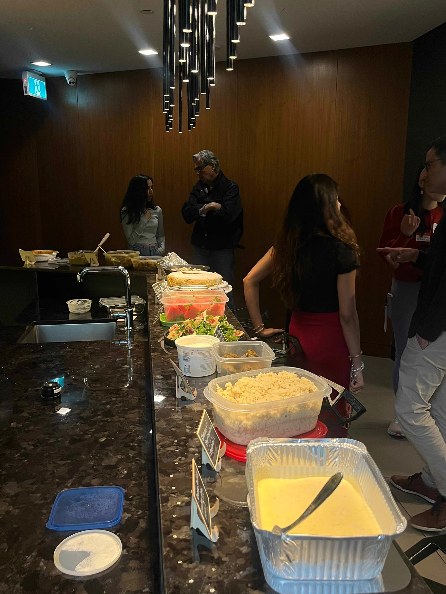
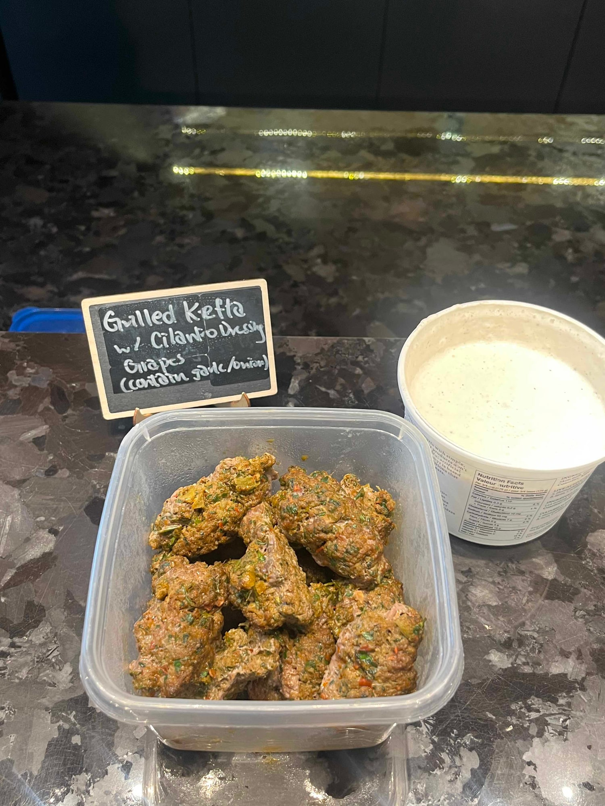
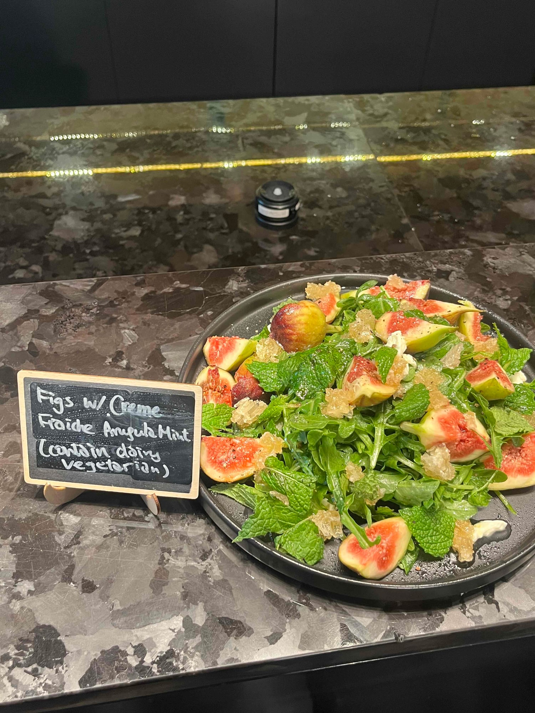
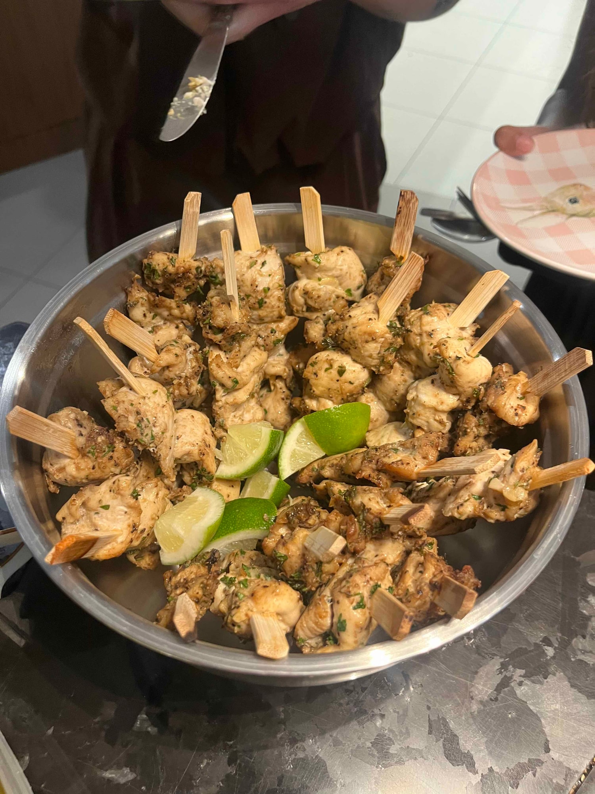
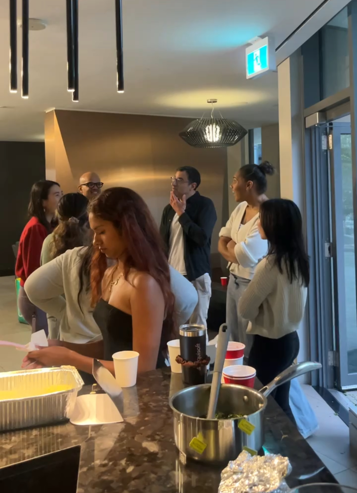

*Mourad: New Moroccan* filters Moroccan food through a San Francisco restaurant kitchen, so the recipes carry the technique of one place and the flavours of another. That is what makes the book interesting. It still assumes you are feeding a lot of people and that everyone is staying a while, which suited us.

Most of what turned up had been cooking for hours and you could tell, because the spicing had settled into everything rather than sitting on top of it. Grilled kefta arrived herb flecked all the way through, with a cilantro dressing and a tub of yogurt next to it. Chicken skewers. Figs with creme fraiche, arugula and mint, which were mine, and which looked like a great deal more work than they were.

It was the first properly warm month of the year, which changed the mood of the room entirely. People stood around talking for a long time before anyone went near the food.

It was the kind of table where you keep going back for a bit more of something rather than taking a full second plate, and end up eating far more that way without noticing until the end.

We run one of these every month. [Subscribers get the link](/contact) before spots open to everyone.

