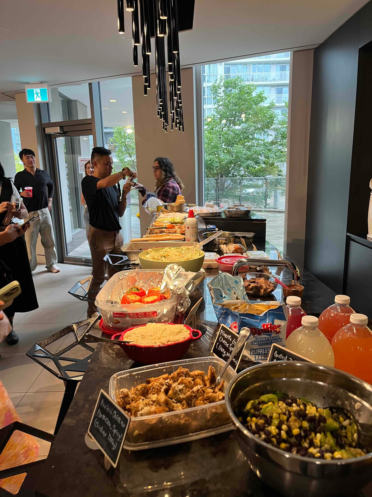
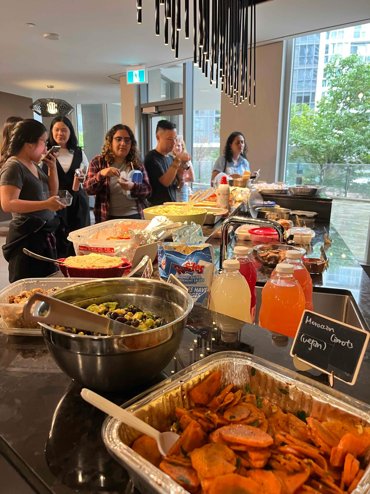
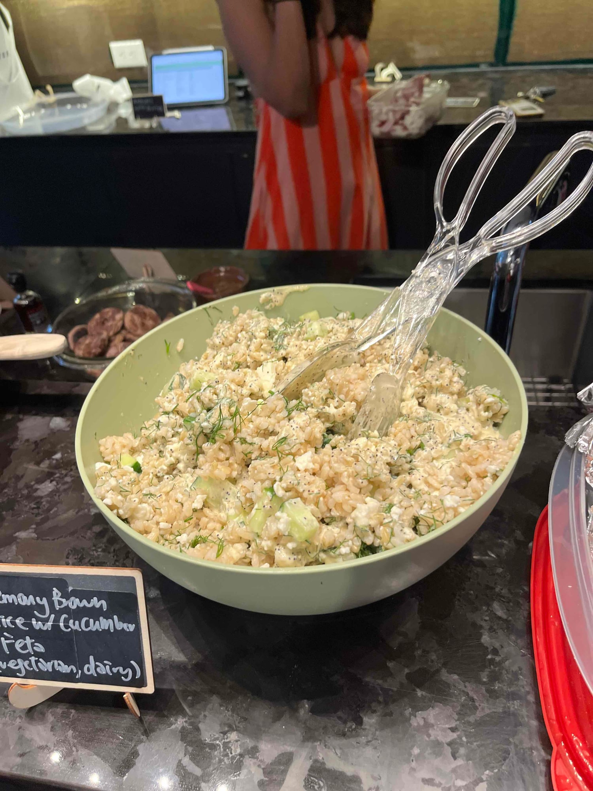
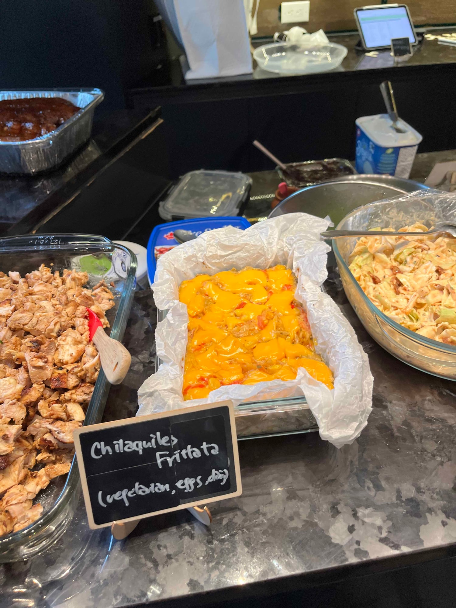
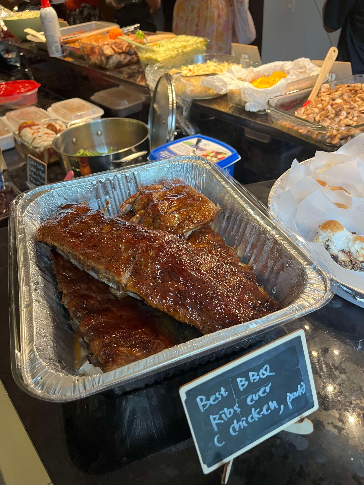
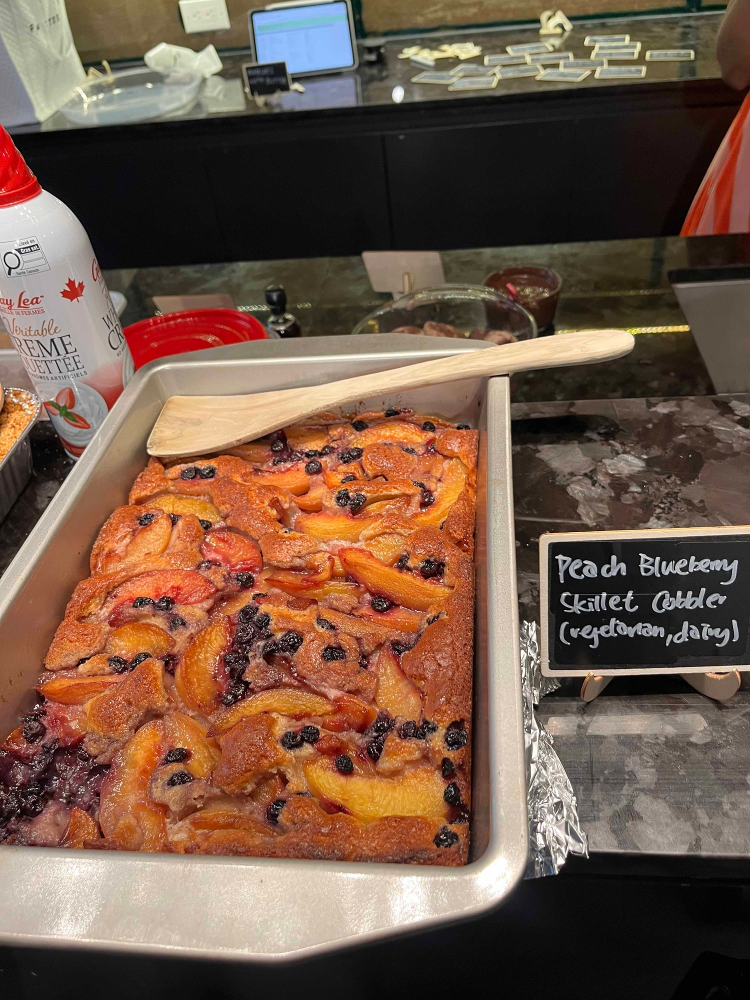

We called our August night Summer Isn't Over Yet. The weather had other ideas.

The plan was a park picnic, put together with our friends at SocialSip Toronto. Permit sorted, book chosen, everybody signed up for a dish. Then the forecast turned and stayed turned, and by the day of it was clearly not happening outdoors.

So we moved the whole thing into a party room and ran it from there instead.

That room is where Sauté Sundays started. Before the waitlist, before Jrew's, before any of this looked like a real club, it was a handful of people in a party room with too much food between them. Ending up back there for a night we'd planned as an outdoor picnic was not what any of us had in mind, but it turned into one of the better evenings we've had. People stayed late. The rain outside made the room feel smaller in a good way.

For anyone finding us here: Sauté Sundays is a free monthly cookbook club in Toronto. We pick one cookbook, everyone claims a different recipe, cooks it at home, and brings the dish to the table. Then we eat together and compare notes, what worked, what was harder than the recipe made it sound, and what we'd change. It's free to attend, and you don't have to be a good cook.

August's book was Endless Summer Cookbook by Katie Lee, which is built around exactly the kind of outdoor warm weather entertaining we'd planned the night around. Reading a book about beach days and backyard parties while it poured outside was funny in a way that made the whole thing better, honestly. The food didn't care where it was being eaten.

If you've been thinking about coming, August was a good reminder that the plan can fall apart and the night can still be great. That's more or less the whole idea.

More on the book itself in [the cookbook highlight](/blog/cookbook-summer-aug-2026).

September is *Mastering the Art of Japanese Home Cooking*, Sunday the 20th at Jrew's. [RSVP on Luma](https://luma.com/oz1ooaiv), or [subscribe](/contact) for early access.
