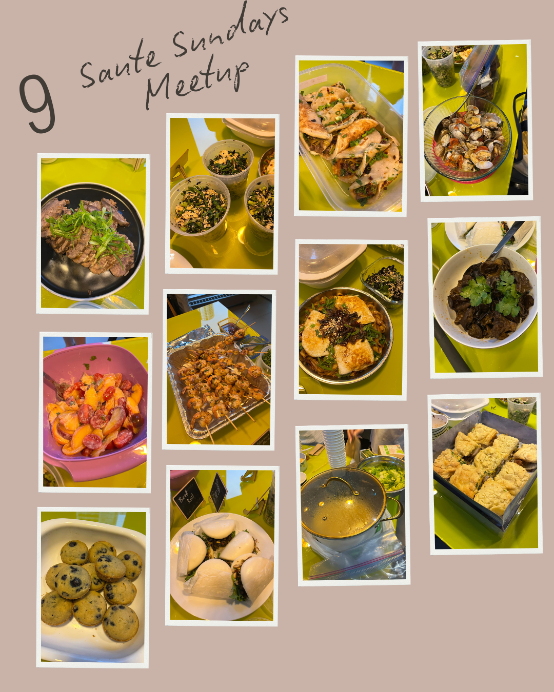

*Win Son Presents a Taiwanese American Cookbook* comes from the Brooklyn restaurant of the same name and reads like a record of what its cooks actually make. That suited a table like ours, which runs on lots of small things meant to be shared.

Nothing arrived in courses. Beef rolls came already sliced, sloppy bao came already filled, clams sat next to a tray of shrimp skewers that were gone almost immediately. There were wood ear mushrooms under a handful of cilantro, cups of dressed greens portioned out so nobody had to serve themselves from one big bowl, and blueberry muffins at the end that were not Taiwanese in any sense and that nobody objected to. You could eat from one end of the table to the other and still not try everything, which is more or less what we are aiming for.

Teresa brought the soup, and she brought it from Markham. That is an hour with a pot on the back seat, for a room of people she had mostly never met. That is the bit I still think about.

We run one of these every month. [Subscribers get the link](/contact) before spots open to everyone.
