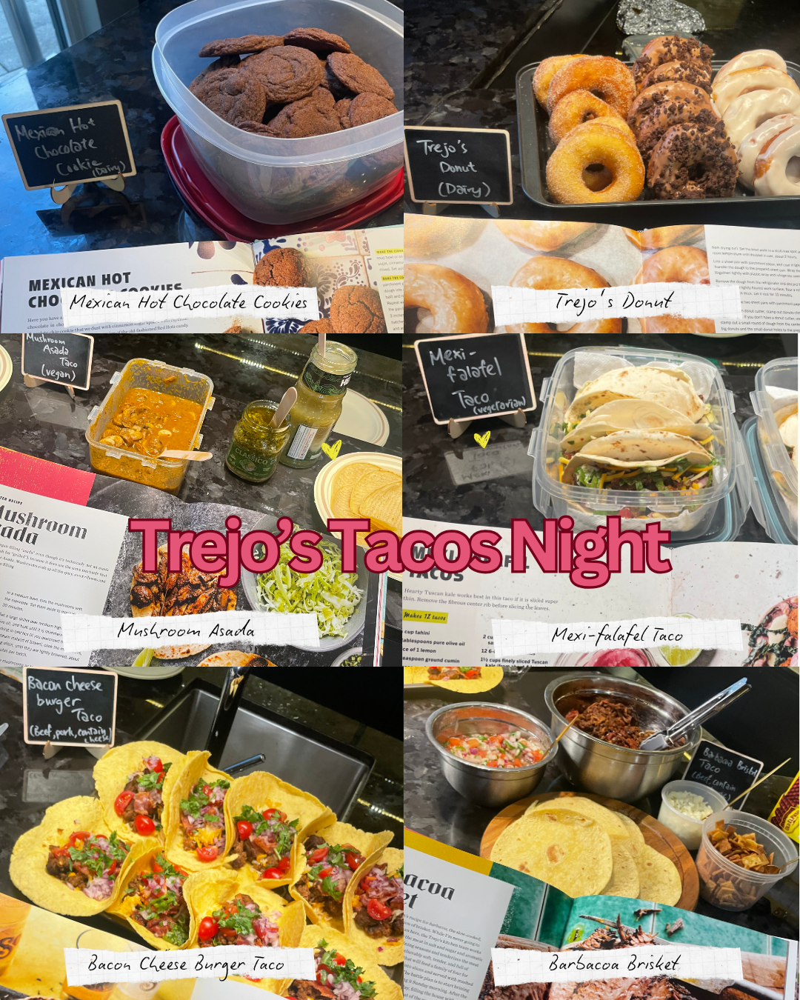

*Trejo's Tacos* comes out of Danny Trejo's taquerias in Los Angeles, and it turned out to be built for the kind of night we run. Almost nothing in it is a finished plate. It is components, and components are what a room of thirty five cooks does best.

So dinner assembled itself. Warm tortillas at one end, then barbacoa brisket, a bacon cheeseburger taco that should not have worked and did, a mushroom asada that happened to be vegan, a mexi falafel for the vegetarians. You built one, ate it standing up, went back and built a different one. Nobody sat down for long, which is usually the sign of a good night. Mexican hot chocolate cookies and a tray of donuts turned up at the end, because somebody always reads to the back of the book.

The brisket was Bana's, and it had taken her 48 hours. You only find that sort of thing out standing at the counter, when you tell someone their dish is good and they tell you exactly how many days went into it. That is the conversation this whole club exists for.

We run one of these every month. [Subscribers get the link](/contact) before spots open to everyone.
