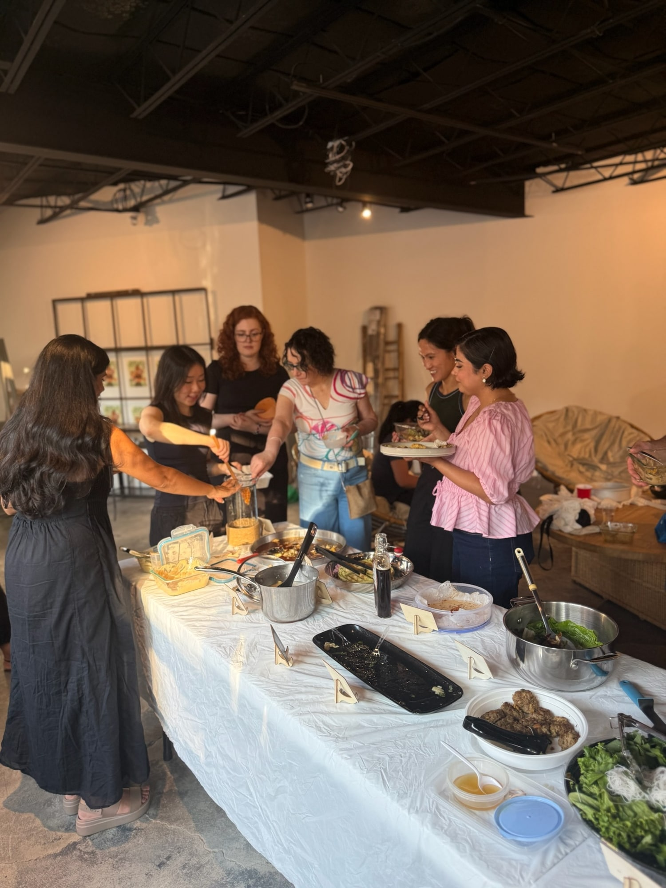
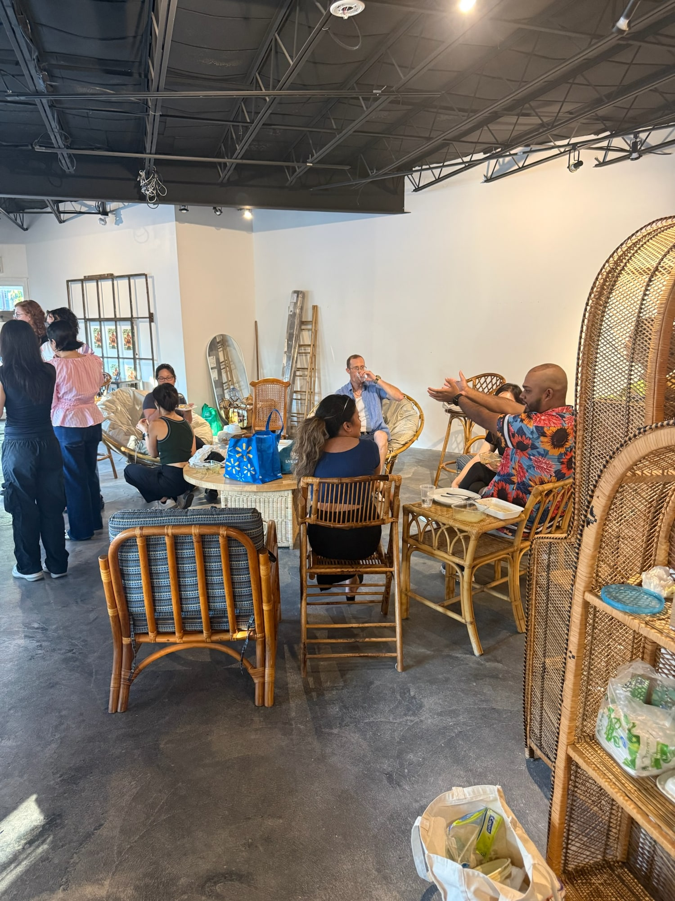
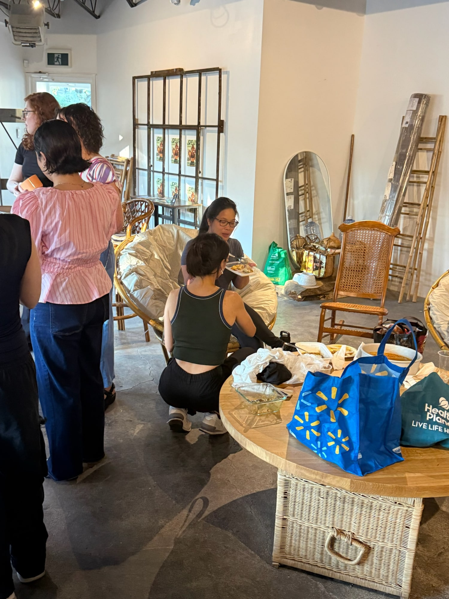
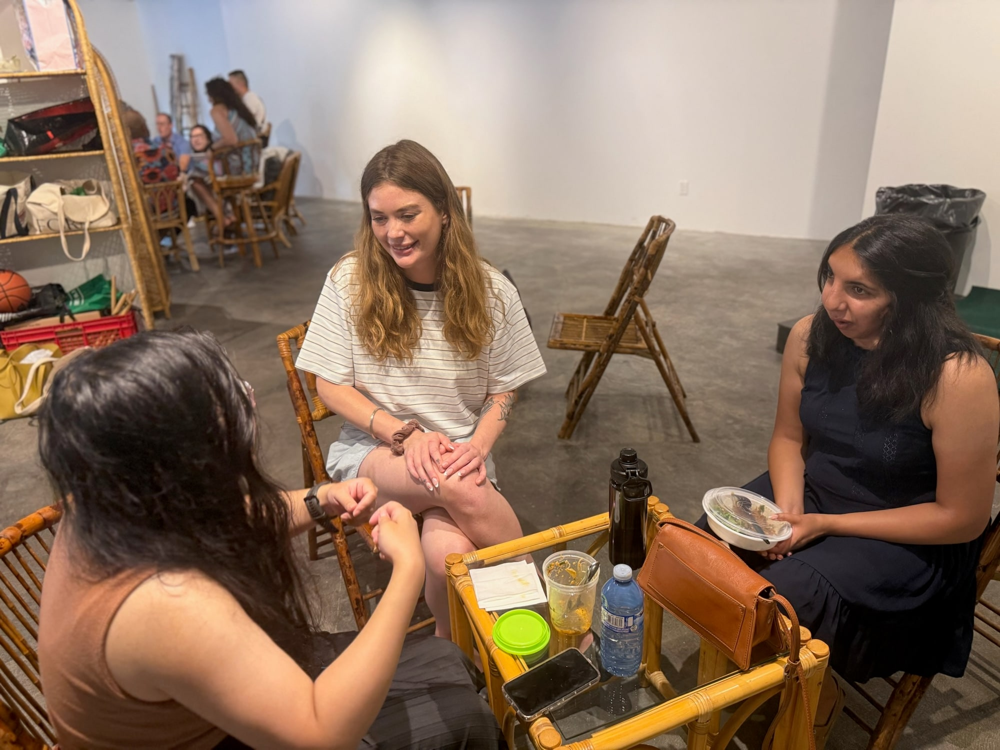
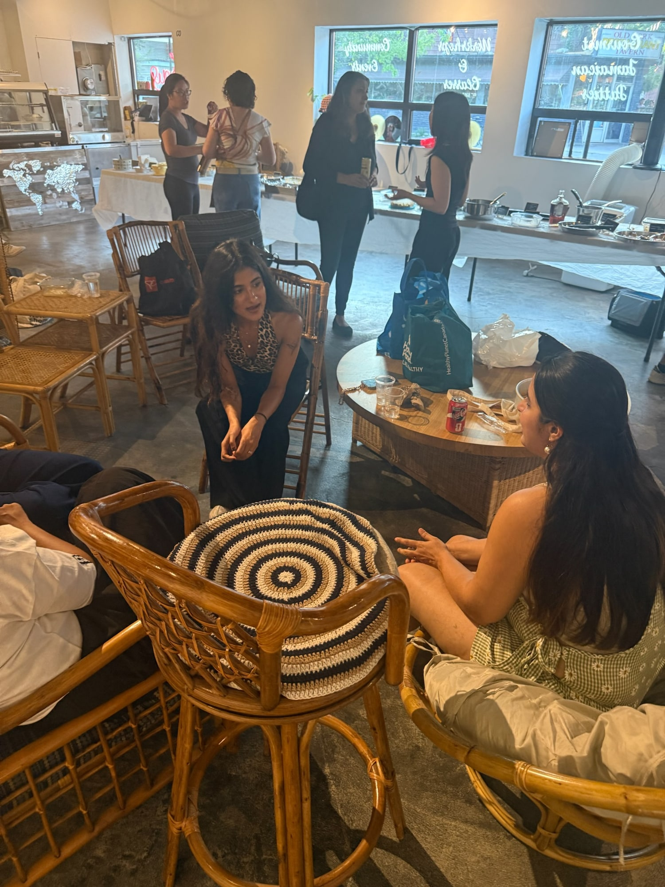

July was *Vietnamese Food Any Day* by Andrea Nguyen, built around the idea that you can get real Vietnamese flavour from a regular grocery run. You can make most of it without specialist shopping or turning dinner into an all day project, which made it a good July pick when nobody wanted a four hour build.

I missed this one. My partner went and brought me leftovers, which is the second best way to attend a Sauté Sundays and a better review than anything I could have written. The photos are from the people who were actually there.

August is outdoors at Trinity Bellwoods with SocialSip, cooking from *Endless Summer* by Katie Lee. [Subscribers get the link](/contact) first.

